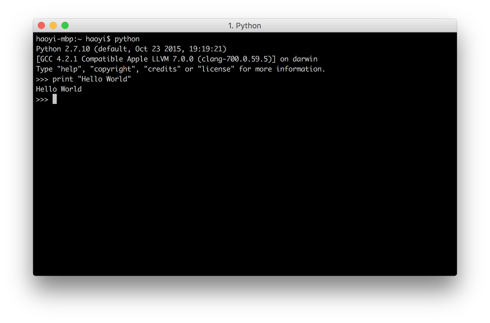
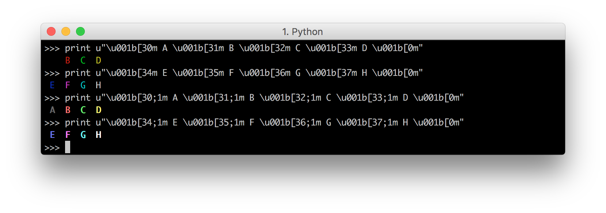
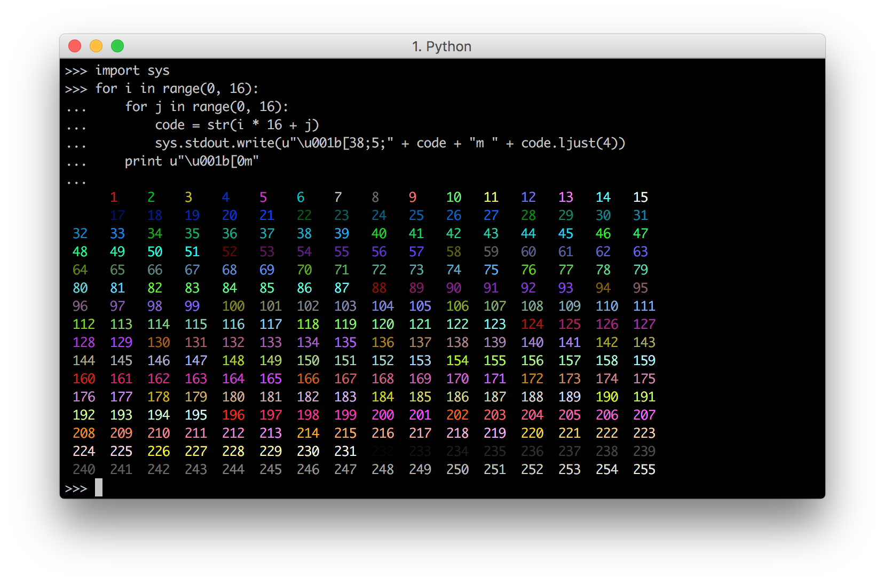
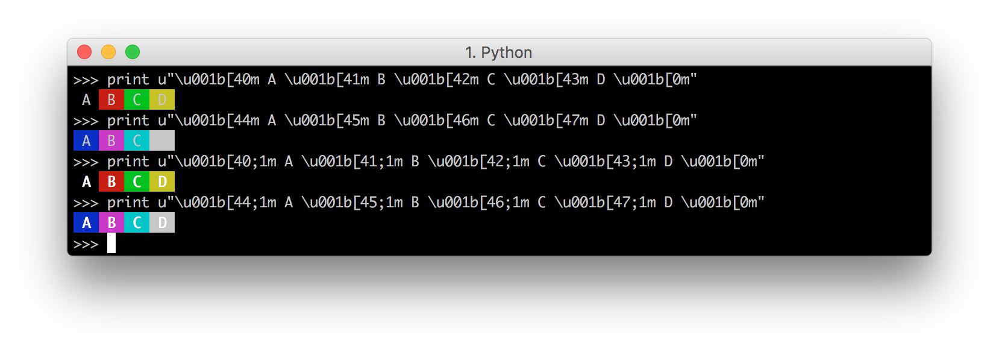
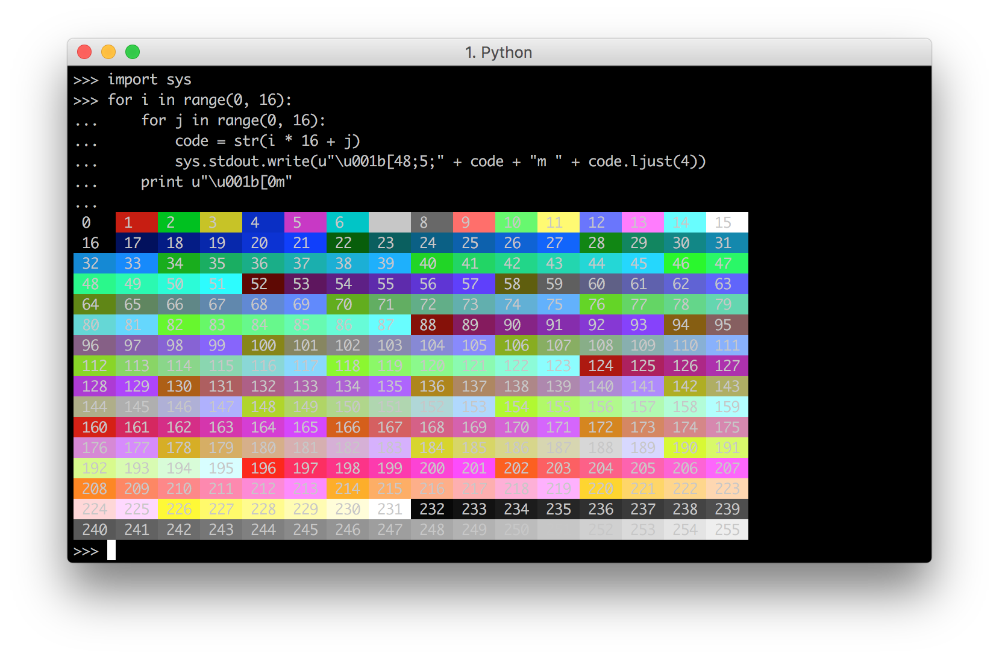
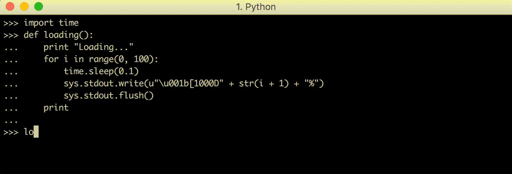
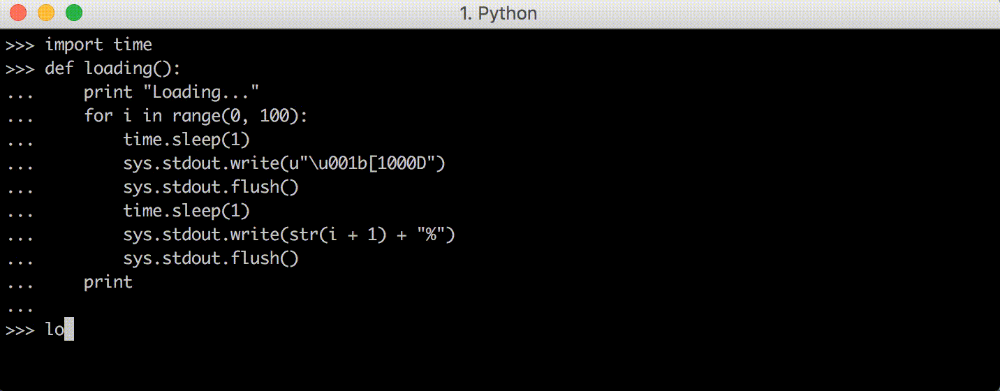
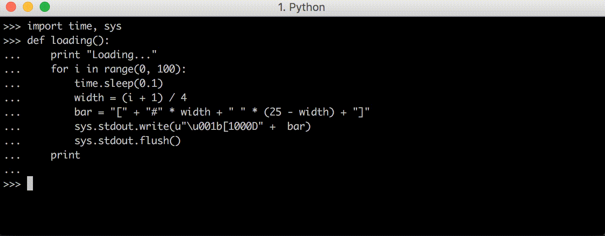
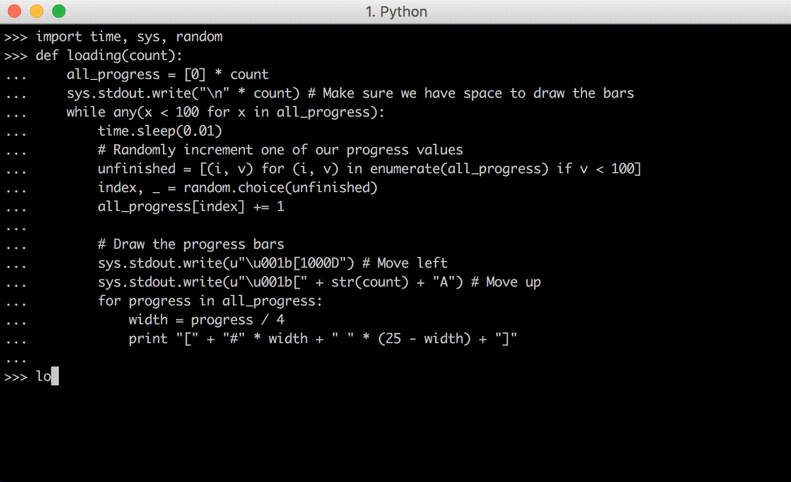
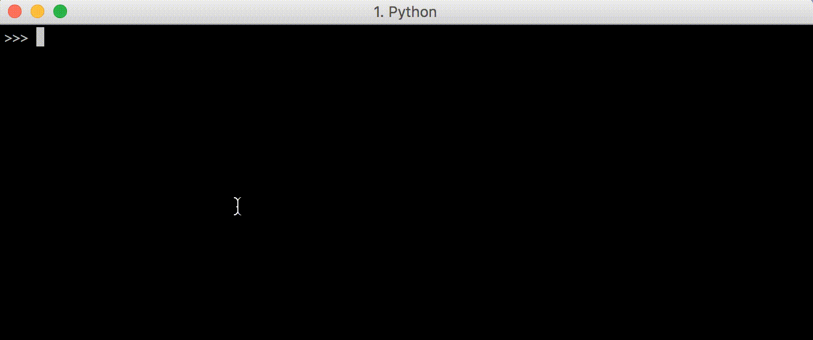

Everyone is used to printing out output in a terminal that scrolls as new text 
appears, but that's not all your can do: you can color your text, you can move 
the cursor up, down, left or right, or clear portions of the screen if you are 
going to re-print them later. This is what lets programs like [Git] implement
its dynamic progress indicators, and [Vim] or [Bash] implement their editors
that let you modify already-displayed text without scrolling the terminal.

There are libraries like [Readline], [JLine], or the [Python Prompt Toolkit]
that help you do this in various programming languages, but you can also do it
yourself. This post will explore the basics of how you can control the terminal
from any command-line program, with examples in Python, and how your own code
can directly make use of all the special features the terminal has to offer.

[Git]: https://en.wikipedia.org/wiki/Git_(software)
[Vim]: https://en.wikipedia.org/wiki/Vim_(text_editor)
[Emacs]: https://en.wikipedia.org/wiki/Emacs
[Bash]: https://en.wikipedia.org/wiki/Bash_(Unix_shell)
[Readline]: https://en.wikipedia.org/wiki/GNU_Readline
[JLine]: https://github.com/jline/jline2
[Python Prompt Toolkit]: https://github.com/jonathanslenders/python-prompt-toolkit

-------------------------------------------------------------------------------

The way that most programs interact with the Unix terminal is through [ANSI 
escape codes]. These are special codes that your program can print in order to 
give the terminal instructions. Various terminals support different subsets
of these codes, and it's difficult to find a "authoritative" list of what every
code does. Wikipedia has a [reasonable
listing](https://en.wikipedia.org/wiki/ANSI_escape_code#CSI_codes) of them, as
do many other sites.

Nevertheless, it's possible to write programs that make use of ANSI escape 
codes, and at least will work on common Unix systems like Ubuntu or OS-X 
(though not Windows, which I won't cover here and is its own adventure!). This
post will explore the basics of what Ansi escape codes exist, and demonstrate
how to use them to write your own interactive command-line from first
principles:

- [Rich Text](#rich-text)
    - [Colors](#colors)
        - [8 Colors](#8-colors) 
        - [16 Colors](#16-colors) 
        - [256 Colors](#256-colors) 
    - [Background Colors](#background-colors)
    - [Decorations](#decorations)
- [Cursor Navigation](#cursor-navigation)
    - [Progress Indicator](#progress-indicator)
    - [ASCII Progress bar](#ascii-progress-bar)
- [Writing a Command Line](#writing-a-command-line) 
    - [User Input](#user-input)
    - [A Basic Command Line](#a-basic-command-line)
    - [Cursor Navigation](#cursor-navigation)
    - [Deletion](#deletion)
    - [Completeness?](#completeness)
- [Customizing your Command Line](#customizing-your-command-line)
- [Conclusion](#conclusion)

To begin with, let's start off with a plain-old vanilla Python prompt:



And get started!

## Rich Text

The most basic Ansi escape codes are those involved in rendering text. These 
let you add decorations like [Colors](#colors), [Background 
Colors](#background-colors) or other [Decorations](#decorations) to your 
printed text, but don't do anything fancy. The text you print will still end
up at the bottom of the terminal, and still make your terminal scroll, just now
it will be colored text instead of the default black/white color scheme your
terminal has.

### Colors

The most basic thing you can do to your text is to color it. The Ansi colors
all look like 

- **Red**: `\u001b[31m`
- **Reset**: `\u001b[0m`

This `\u001b` character is the special character that starts off most Ansi
escapes; most languages allow this syntax for representing special characters,
e.g. Java, Python and Javascript all allow the `\u001b` syntax.

For example here is printing the string `"Hello World"`, but red:

```python
print u"\u001b[31mHelloWorld"
```


Note how we need to prefix the string with `u` i.e. `u"..."` in order for this
to work in Python 2.7.10. This is not necessary in Python 3 or in other 
languages.

See how the red color, starting from the printed `Hello World`, ends up 
spilling into the `>>>` prompt. In fact, any code we type into this prompt
will also be colored red, as will any subsequent output! That is how Ansi 
colors work: once you print out the special code enabling a color, the color
persists forever until someone else prints out the code for a different color,
or prints out the **Reset** code to disable it.

We can disable it by printing the **Reset** code above:

```python
print u"\u001b[0m"
```


 
And we can see the prompt turns back white. In general, you should always 
remember to end any colored string you're printing with a **Reset**, to make
sure you don't accidentally

To avoid this, we need to make sure we end our colored-string with the 
**Reset** code:

```python
print u"\u001b[31mHelloWorld\u001b[0m"
```


Which propertly resets the color after the string has been printed. You can 
also **Reset** halfway through the string to make the second-half un-colored:

```python
print u"\u001b[31mHello\u001b[0mWorld"
```


#### 8 Colors

We have seen how **Red** and **Reset** work. The most basic terminals have a 
set of 8 different colors:

- **Black**: `\u001b[30m`
- **Red**: `\u001b[31m`
- **Green**: `\u001b[32m`
- **Yellow**: `\u001b[33m`
- **Blue**: `\u001b[34m`
- **Magenta**: `\u001b[35m`
- **Cyan**: `\u001b[36m`
- **White**: `\u001b[37m`

- **Reset**: `\u001b[0m`

Which we can demonstrate by printing one letter of each color, followed by a 
**Reset**:

```python
print u"\u001b[30m A \u001b[31m B \u001b[32m C \u001b[33m D \u001b[0m"
print u"\u001b[34m E \u001b[35m F \u001b[36m G \u001b[37m H \u001b[0m"
```


Note how the black `A` is totally invisible on the black terminal, while the 
white `H` looks the same as normal text. If we chose a different color-scheme 
for our terminal, it would be the opposite:

```python
print u"\u001b[30;1m A \u001b[31;1m B \u001b[32;1m C \u001b[33;1m D \u001b[0m"
print u"\u001b[34;1m E \u001b[35;1m F \u001b[36;1m G \u001b[37;1m H \u001b[0m"
```


With the black `A` being obvious and the white `H` being hard to make out.

#### 16 Colors

Most terminals, apart from the basic set of 8 colors, also support the "bright"
or "bold" colors. These have their own set of codes, mirroring the normal 
colors, but with an additional `;1` in their codes:

- **Bright Black**: `\u001b[30;1m`
- **Bright Red**: `\u001b[31;1m`
- **Bright Green**: `\u001b[32;1m`
- **Bright Yellow**: `\u001b[33;1m`
- **Bright Blue**: `\u001b[34;1m`
- **Bright Magenta**: `\u001b[35;1m`
- **Bright Cyan**: `\u001b[36;1m`
- **Bright White**: `\u001b[37;1m`

- **Reset**: `\u001b[0m`

Note that **Reset** is the same: this is the reset code that resets *all* 
colors and text effects.
 
We can print out these bright colors and see their effects:



And see that they are, indeed, much brighter than the basic set of 8 colors. 
Even the black `A` is now bright enough to be a visible gray on the black 
background, and the white `H` is now even brighter than the default text color.

#### 256 Colors

Lastly, after the 16 colors, some terminals support a 256-color extended color
set.

These are of the form

- `\u001b[38;5;${ID}m`

```python
import sys
for i in range(0, 16):
    for j in range(0, 16):
        code = str(i * 16 + j)
        sys.stdout.write(u"\u001b[38;5;" + code + "m " + code.ljust(4))
    print u"\u001b[0m"
```


Here we use `sys.stdout.write` instead of `print` so we can print multiple items
on the same line, but otherwise it's pretty self-explanatory. Each code from 0
to 255 corresponds to a particular color.

### Background Colors

The Ansi escape codes let you set the color of the text-background the same way
it lets you set the color of the foregrond. For example, the 8 background 
colors correspond to the codes:

- **Background Black**: `\u001b[40m`
- **Background Red**: `\u001b[41m`
- **Background Green**: `\u001b[42m`
- **Background Yellow**: `\u001b[43m`
- **Background Blue**: `\u001b[44m`
- **Background Magenta**: `\u001b[45m`
- **Background Cyan**: `\u001b[46m`
- **Background White**: `\u001b[47m`

With the bright versions being:

- **Background Bright Black**: `\u001b[40;1m`
- **Background Bright Red**: `\u001b[41;1m`
- **Background Bright Green**: `\u001b[42;1m`
- **Background Bright Yellow**: `\u001b[43;1m`
- **Background Bright Blue**: `\u001b[44;1m`
- **Background Bright Magenta**: `\u001b[45;1m`
- **Background Bright Cyan**: `\u001b[46;1m`
- **Background Bright White**: `\u001b[47;1m`

And reset is the same:

- **Reset**: `\u001b[0m`

We can print them out and see them work

```python
print u"\u001b[40m A \u001b[41m B \u001b[42m C \u001b[43m D \u001b[0m"
print u"\u001b[44m A \u001b[45m B \u001b[46m C \u001b[47m D \u001b[0m"
print u"\u001b[40;1m A \u001b[41;1m B \u001b[42;1m C \u001b[43;1m D \u001b[0m"
print u"\u001b[44;1m A \u001b[45;1m B \u001b[46;1m C \u001b[47;1m D \u001b[0m"
```



Note that the bright versions of the background colors do not change the 
background, but rather make the *foreground* text brighter. This is unintuitive
but that's just the way it works.

256-colored backgrounds work too:


```python
import sys
for i in range(0, 16):
    for j in range(0, 16):
        code = str(i * 16 + j)
        sys.stdout.write(u"\u001b[48;5;" + code + "m " + code.ljust(4))
    print u"\u001b[0m"
```



### Decorations

Apart from colors, and background-colors, Ansi escape codes also allow 
decorations on the text:
 
- **Bold**: `\u001b[1m` 
- **Underline**: `\u001b[4m`
- **Reversed**: `\u001b[7m`

Which can be used individually:

```python
print u"\u001b[1m BOLD \u001b[0m\u001b[4m Underline \u001b[0m\u001b[7m Reversed \u001b[0m"
```


Or together

```python
print u"\u001b[1m\u001b[4m\u001b[7m BOLD Underline Reversed \u001b[0m"
```


And can be used together with foreground and background colors:

```python
print u"\u001b[1m\u001b[31m Red Bold \u001b[0m"
print u"\u001b[4m\u001b[44m Blue Background Underline \u001b[0m"
```


## Cursor Navigation

The next set of Ansi escape codes are more complex: they allow you to move the
cursor around the terminal window, or erase parts of it. These are the Ansi
escape codes that programs like Bash use to let you move your cursor left and
right across your input command in response to arrow-keys.

The most basic of these moves your cursor up, down, left or right:

- **Up**: `\u001b[{n}A`
- **Down**: `\u001b[{n}B`
- **Right**: `\u001b[{n}C`
- **Left**: `\u001b[{n}D`

To make use of these, first let's establish a baseline of what the "normal" 
Python prompt does.

Here, we add a `time.sleep(10)` just so we can see it in action. We can see 
that if we print something, first it prints the output and moves our cursor 
onto the next line:

```python
import time
print "Hello I Am A Cow"; time.sleep(10)
```


Then it prints the next prompt and moves our cursor to the right of it.


So that's the baseline of where the cursor already goes. What can we do with
this?

#### Progress Indicator

The easiest thing we can do with our cursor-navigation Ansi escape codes is to
make a loading prompt:

```python
import time, sys
def loading():
    print "Loading..."
    for i in range(0, 100):
        time.sleep(0.1)
        sys.stdout.write(u"\u001b[1000D" + str(i + 1) + "%")
        sys.stdout.flush()
    print
    
loading()
```

This prints the text from `1%` to `100%`, all on the same line since it uses
`stdout.write` rather than `print`. However, before printing each percentage it
first prints `\u001b[1000D`, which means "move cursor left by 1000 characters).
This should move it all the way to the left of the screen, thus letting the new
percentage that gets printed over-write the old one. Hence we see the loading
percentage seamlessly changing from `1%` to `100%` before the function returns:



It might be a bit hard to visualize in your head where the cursor is moving, 
but we can easily slow it down and add more `sleep`s to make the code show us:
```python
import time, sys
def loading():
    print "Loading..."
    for i in range(0, 100):
        time.sleep(1)
        sys.stdout.write(u"\u001b[1000D")
        sys.stdout.flush()
        time.sleep(1)
        sys.stdout.write(str(i + 1) + "%")
        sys.stdout.flush()
    print
    
loading()
```

Here, we split up the `write` that writes the "move left" escape code, from
the write that writes the percentage progress indicator. We also added a 1
second sleep between them, to give us a chance to see the cursors "in between"
states rather than just the end result:



Now, we can see the cursor moving left to the edge of the screen, before the 
new printed percentage over-writes the old one.

#### ASCII Progress Bar

Now that we know how to make a self-updating progress bar using Ansi escape
codes to control the terminal, it becomes relatively easy to modify it to
be fancier, e.g. having a ASCII bar that goes across the screen:

```python
import time, sys
def loading():
    print "Loading..."
    for i in range(0, 100):
        time.sleep(0.1)
        width = (i + 1) / 4
        bar = "[" + "#" * width + " " * (25 - width) + "]"
        sys.stdout.write(u"\u001b[1000D" +  bar)
        sys.stdout.flush()
    print
    
loading()
```



This works as you would expect: every iteration of the loop, the entire row is
erased and a new version of the ASCII bar is drawn.

We could even use the **Up** and **Down** cursor movements to let us draw 
multiple progress bars at once:

```python
import time, sys, random
def loading(count):
    all_progress = [0] * count
    sys.stdout.write("\n" * count) # Make sure we have space to draw the bars
    while any(x < 100 for x in all_progress):
        time.sleep(0.01)
        # Randomly increment one of our progress values
        unfinished = [(i, v) for (i, v) in enumerate(all_progress) if v < 100]
        index, _ = random.choice(unfinished)
        all_progress[index] += 1
        
        # Draw the progress bars
        sys.stdout.write(u"\u001b[1000D") # Move left
        sys.stdout.write(u"\u001b[" + str(count) + "A") # Move up
        for progress in all_progress: 
            width = progress / 4
            print "[" + "#" * width + " " * (25 - width) + "]"
        
loading()
```

In this snippet, we have to do several things we did not do earlier:

- Make sure we have enough space to draw the progress bars! This is done by
  writing `"\n" * count` when the function starts. This creates a series of
  newlines that makes the terminal scroll, ensuring that there are exactly
  `count` blank lines at the bottom of the terminal for the progress bars to 
  be rendered on

- Simulated multiple things in progress with the `all_progress` array,
  and having the various slots in that array fill up randomly

- Used the **Up** ansi code to move the cursor `count` lines up
  each time, so we can then print the `count` progress bars one per linee

And it works!



Perhaps next time you are writing a command line application that's downloading
lots of files in parallel, or doing some similar kind of parallel task, you 
could write a similar Ansi-escape-code-based progress bar so the user can see
how their command is progressing.

Of course, all these progress prompts so far are fake: they're not really 
monitoring the progress of any task. Nevertheless, they demonstrate how you
can use Ansi escape codes to put a dynamic progress indicator in any 
command-line program you write, so when you *do* have something whose progress
you can monitor, you now have the ability to put fancy live-updating progress
bars on it.

## Writing a Command Line

One of the more fancy things you might do with Ansi escape codes is to 
implement a command-line. Bash, Python, Ruby, all have their own in-built
command line that lets you type out a command and edit its text before
submitting it for execution. While it may seem special, in reality this command
line is just another program that interacts with the terminal via Ansi escape
codes! Since we know how to use Ansi escape codes, we can do it too and write
our own command line.


### User Input

The first thing we have to do with a command-line, which we haven't done so 
far, is to take user input. This can be done with the following code:

```python
import sys, tty
def command_line():
    tty.setraw(sys.stdin)
    while True:
        char = sys.stdin.read(1)
        if ord(char) == 3: # CTRL-C
            break;
        print ord(char)
        sys.stdout.write(u"\u001b[1000D") # Move all the way left
```

In effect, we use `setraw` to make sure our raw character input goes straight
into our process (without echoing or buffering or anything), and then reading
and echoing the character-codes we see until `3` appears (which is `CTRL-C`, 
the common command for existing a REPL). Since we've turned on `tty.setraw` 
`print` doesn't reset the cursor to the left anymore, so we need to manually 
move left with `\u001b[1000D` after each `print`.

If you run this in the Python prompt (`CTRL-C` to exit) and try hitting some 
characters, you will see that:

- `A` to `Z` are `65` to `90`, `a` to `z` are `97` to `122`
- In fact, every character from `32` to `126` represents a 
  [Printable Character](https://en.wikipedia.org/wiki/ASCII#Printable_characters)
- (Left, Right, Up, Down) are (`27 91 68`, `27 91 67`, `27 91 65`, `27 91 66`).
  This might vary based on your terminal and operating system.
- Enter is `13` or `10` (it varies between computers), Backspace is `127`

Thus, we can try making our first primitive command line that simply echoes
whatever the user typed:

- When the user presses a printable character, print it
- When the user presses Enter, print out the user input at that point, a new 
  line, and start a new empty input.
- When a user presses Backspace, delete one character where-ever the cursor is
- When the user presses an arrow key, move the cursor **Left** or **Right**
  using the Ansi escape codes we saw above

This is obviously greatly simplified; we haven't even covered all the different
kinds of [ASCII characters](https://en.wikipedia.org/wiki/ASCII) that exist, 
nevermind all the [Unicode](https://en.wikipedia.org/wiki/List_of_Unicode_characters) 
stuff! Nevertheless it will be sufficient for a simple proof-of-concept.

### A Basic Command Line

To begin with, let's first implement the first two features:

- When the user presses a printable character, print it
- When the user presses Enter, print out the user input at that point, a new 
  line, and start a new empty input.

No Backspace, no keyboard navigation, none of that. That can come later.

The code for that comes out looking something like this:
 
```python
import sys, tty
 
def command_line():
    tty.setraw(sys.stdin)
    while True: # loop for each line
    # Define data-model for an input-string with a cursor
        input = ""
        while True: # loop for each character
            char = ord(sys.stdin.read(1)) # read one char and get char code
            
            # Manage internal data-model
            if char == 3: # CTRL-C
                return
            elif 32 <= char <= 126:
                input = input + chr(char)
            elif char in {10, 13}:
                sys.stdout.write(u"\u001b[1000D")
                print "\nechoing... ", input
                input = ""

            # Print current input-string
            sys.stdout.write(u"\u001b[1000D")  # Move all the way left
            sys.stdout.write(input)
            sys.stdout.flush()
```

Note how we

And you can see it working:



As we'd expect, arrow keys don't work and result in odd `[D [A [C [B`
characters being printed, which correspond to the arrow key codes we saw
above. We will get that working next. Nevertheless, we can enter text and then
submit it with Enter.

Paste this into your own Python prompt to try it out!

### Cursor Navigation

The next step would be to let the user move the cursor around using arrow-keys.
This is provided by default for Bash, Python, and other command-lines, but as
we are implementing our own command line here we have to do it ourselves. We 
know that the arrow keys **Left** and **Right** correspond to the sequences of
character-codes `27 91 68`, `27 91 67`, so we can put in code to check for 
those and appropiately move the cursor `index` variable

```python
import sys, tty
 
def command_line():
    tty.setraw(sys.stdin)
    while True: # loop for each line
    # Define data-model for an input-string with a cursor
        input = ""
        index = 0
        while True: # loop for each character
            char = ord(sys.stdin.read(1)) # read one char and get char code
            
            # Manage internal data-model
            if char == 3: # CTRL-C
                return
            elif 32 <= char <= 126:
                input = input[:index] + chr(char) + input[index:]
                index += 1
            elif char in {10, 13}:
                sys.stdout.write(u"\u001b[1000D")
                print "\nechoing... ", input
                input = ""
                index = 0
            elif char == 27:
                next1, next2 = ord(sys.stdin.read(1)), ord(sys.stdin.read(1))
                if next1 == 91:
                    if next2 == 68: # Left
                        index = max(0, index - 1)
                    elif next2 == 67: # Right
                        index = min(len(input), index + 1)
                
            # Print current input-string
            sys.stdout.write(u"\u001b[1000D") # Move all the way left
            sys.stdout.write(input)
            sys.stdout.write(u"\u001b[1000D") # Move all the way left again
            if index > 0:
                sys.stdout.write(u"\u001b[" + str(index) + "C") # Move cursor too index
            sys.stdout.flush()
```

The three main changes are:

- We now maintain an `index` variable. Previously, the cursor was always at
  the right-end of the `input`, since you couldn't use arrow keys to move it
  left, and new input was always appended at the right-end. Now, we need to
  keep a separate `index` which is not necessarily at the end of the `input`,
  and when a user enters a character we splice it into the `input` in the
  correct location.

- We check for `char == 27`, and then also check for the next two characters
  to identify the **Left** and **Right* arrow keys, and increment/decrement 
  the `index` of our cursor (making sure to keep it within the `input` string.

- After writing the `input`, we now have to manually move the cursor all the 
  way to the left and move it rightward the correct number of characters 
  corresponding to our cursor `index`. Previously the cursor was always at the
  right-most point of our `input` because arrow keys didn't work, but now the 
  cursor could be anywhere.

As you can see, it works:
 


It would take more effort to make **Home** and **End** (or **Fn-Left** and
**Fn-Right**) work, as well as Bash-like shortcuts like **Esc-f** and 
**Esc-B**, but there's nothing in principle difficult about those: you just 
need to write down the code-sequences they produce the same way we did [at
the start of this section](#writing-a-command-line), and make them change
our cursor `index` appropriately.

### Deletion

The last thing on our feature list to implement is deletion: using 
**Backspace** should cause one character before the cursor to disappear,
and move the cursor left by 1. This can be done naively by inserting an
 
```diff
+ elif char == 127:
+     input = input[:index-1] + input[index:]
+     index -= 1
```

Into our conditional. This works, somewhat, but not entirely as expected:


As you can see, the deletion works, in that after I delete the characters,
they are no longer echoed back at me when I press **Enter** to submit. However,
the characters are still sitting their *on screen* even as I delete them! At
least until they are over-written with *new* characters, as can be seen in the
third line in the above example.

The problem is that so far, we have never actually cleared the entire line:
we've always just written the new characters over the old characters, assuming
that the string of new characters would be longer and over-write them. This is
no longer true once we can delete characters.

A fix is to use the **Clear Line** Ansi escape code `\u001b[0K`, one of a set
of Ansi escape codes which lets you clear various portions of the terminal:

- **Clear Screen**: `\u001b[{n}J` clears the screen
    - `n=0` clears from cursor until end of screen,
    - `n=1` clears from cursor to beginning of screen
    - `n=2` clears entire screen
- **Clear Line**: `\u001b[{n}K` clears the current line
    - `n=0` clears from cursor to end of line
    - `n=1` clears from cursor to start of line
    - `n=2` clears entire line

This particular code:

```diff
+ sys.stdout.write(u"\u001b[0K")
```

Clears all characters from the cursor to the end of the line. That lets us make
sure that when we delete and re-print a shorter input after that, any
"leftover" text that we're not over-writing still gets properly cleared from
the screen.

The final code looks like:

```python
import sys, tty
 
def command_line():
    tty.setraw(sys.stdin)
    while True: # loop for each line
    # Define data-model for an input-string with a cursor
        input = ""
        index = 0
        while True: # loop for each character
            char = ord(sys.stdin.read(1)) # read one char and get char code
            
            # Manage internal data-model
            if char == 3: # CTRL-C
                return
            elif 32 <= char <= 126:
                input = input[:index] + chr(char) + input[index:]
                index += 1
            elif char in {10, 13}:
                sys.stdout.write(u"\u001b[1000D")
                print "\nechoing... ", input
                input = ""
                index = 0
            elif char == 27:
                next1, next2 = ord(sys.stdin.read(1)), ord(sys.stdin.read(1))
                if next1 == 91:
                    if next2 == 68: # Left
                        index = max(0, index - 1)
                    elif next2 == 67: # Right
                        index = min(len(input), index + 1)
            elif char == 127:
                input = input[:index-1] + input[index:]
                index -= 1
            # Print current input-string
            sys.stdout.write(u"\u001b[1000D") # Move all the way left
            sys.stdout.write(u"\u001b[0K")    # Clear the line
            sys.stdout.write(input)
            sys.stdout.write(u"\u001b[1000D") # Move all the way left again
            if index > 0:
                sys.stdout.write(u"\u001b[" + str(index) + "C") # Move cursor too index
            sys.stdout.flush()
```

And i you paste this into the command-line, it works!


At this point, it's worth putting some `sys.stdout.flush(); time.sleep(0.2);`s 
into the code, after every `sys.stdout.write`, just to see it working. If you 
do that, you will see something like this: 


Where it is plainly obvious each time you enter a character, 

- The cursor moves to the start of the line `sys.stdout.write(u"\u001b[1000D")`
- The line is cleared `sys.stdout.write(u"\u001b[0K")`
- The current input is written `sys.stdout.write(input)`
- The cursor is moved again to the start of the line `sys.stdout.write(u"\u001b[1000D")`
- The cursor is moved to the correct index `sys.stdout.write(u"\u001b[" + str(index) + "C")`

Normally, when you are using this code, it all happens instantly when 
`.flush()` is called. However, it is still valuable to see what is actually 
going on, so that you can understand it when it works and debug it when it 
misbehaves!


### Completeness?

We now have a minimal command-line, implemented ourselves using 
`sys.stdin.read` and `sys.stdout.write`, using ANSI escape codes to control
the terminal. It is missing out a lot of functionality and hotkeys that 
"standard" command-lines provide, things like:

- `Alt-f` to move one word right
- `Alt-b` to move one word left
- `Alt-Backspace` to delete one word on the left
- ...many other command command-line hotkeys, some of which are listed
  [here](http://www.bigsmoke.us/readline/shortcuts)

And currently isn't robust enough to work with e.g. multi-line input strings,
single-line input strings that are long enough to wrap, or display a
customizable prompt to the user.

Nevertheless, implementing support for those hotkeys and robustness for various
edge-case inputs is just more of the same: picking a use case that doesn't
work, and figuring out the right combination of internal logic and ANSI escape
codes to make the terminal behave as we'd expect.

There are other terminal commands that would come in useful; Wikipedia's
[table of escape codes](https://en.wikipedia.org/wiki/ANSI_escape_code#CSI_codes)
is a good listing (the *CSI* in that table corresponds to the `\u001b` in our
code) but here are some useful ones:

-------------------------------------------------------------------------------

- **Up**: `\u001b[{n}A` moves cursor up by `n`
- **Down**: `\u001b[{n}B` moves cursor down by `n`
- **Right**: `\u001b[{n}C` moves cursor right by `n`
- **Left**: `\u001b[{n}D` moves cursor left by `n`

-------------------------------------------------------------------------------

- **Next Line**: `\u001b[{n}E` moves cursor to beginning of line `n` lines down
- **Prev Line**: `\u001b[{n}F` moves cursor to beginning of line `n` lines down

-------------------------------------------------------------------------------


- **Set Column**: `\u001b[{n}G` moves cursor to column `n`
- **Set Position**: `\u001b[{n};{m}H` moves cursor to row `n` column `m`

-------------------------------------------------------------------------------

- **Clear Screen**: `\u001b[{n}J` clears the screen
    - `n=0` clears from cursor until end of screen,
    - `n=1` clears from cursor to beginning of screen
    - `n=2` clears entire screen
- **Clear Line**: `\u001b[{n}K` clears the current line
    - `n=0` clears from cursor to end of line
    - `n=1` clears from cursor to start of line
    - `n=2` clears entire line

-------------------------------------------------------------------------------

- **Save Position**: `\u001b[{s}` saves the current cursor position
- **Save Position**: `\u001b[{u}` restores the cursor to the last saved position

-------------------------------------------------------------------------------

These are some of the tools you have available when trying to control the
cursor and terminal, and can be used for all sorts of things: implementing
terminal games, command-lines, text-editors like Vim or Emacs, and other
things. Although it is sometimes confusing what exactly the control codes are
doing, adding `time.sleep`s after each control code. So for now, let's call
this "done"...

## Customizing your Command Line

If you've reached this far, you've worked through colorizing your output, 
writing various dynamic progress indicators, and finally writing a small,
bare-bones command line using Ansi escape codes that echoes user input back
at them. You may think these three tasks are in descending order of usefulness:
colored input is cool, but who needs to implement their own command-line when
every programming language already has one? And there are plenty of libraries 
like [Readline] or [JLine] that do it for you?

It turns out, that in 2016, there still are valid use cases for re-implementing
your own command-line. Many of the existing command-line libraries aren't very
flexible, and can't support basic use cases like syntax-highlighting your 
input. If you want interfaces common in web/desktop programs, like drop-down
menus or `Shift-Left` and `Shift-Right` to highlight and select parts of your
input, most existing implementations will leave you out of luck.

However, now that we have our own from-scratch implementation, syntax
highlighting is as simple as calling a `syntax_highlight` function on our 
`input` string to add the necessary color-codes before printing it::

```diff
+            sys.stdout.write(syntax_highlight(input))
-            sys.stdout.write(input)
```

To demonstrate I'm just going to use a dummy syntax highlighter that highlights 
trailing whitespace; something many programmers hate. 

That's as simple as:

```python
def syntax_highlight(input):
   stripped = input.rstrip()
   return stripped + u"\u001b[41m" + " " *  (len(input) - len(stripped)) + u"\u001b[0m" 
```

And there you have it!


Again, this is a minimal example, but you could imagine swapping out this
`syntax_highlight` implementation for something like [Pygments], which can
perform real syntax highlighting on almost any programming language you will
be writing a command-line for. Just like that, we've added customizable
syntax highlighting in just a few lines of Python code. Not bad!

The complete code below, if you want to copy-paste it to try it out 
yourself: 

```python
import sys, tty
def syntax_highlight(input):
    stripped = input.rstrip()
    return stripped + u"\u001b[41m" + " " *  (len(input) - len(stripped)) + u"\u001b[0m"

def command_line():
    tty.setraw(sys.stdin)
    while True: # loop for each line
        # Define data-model for an input-string with a cursor
        input = ""
        index = 0
        while True: # loop for each character
            char = ord(sys.stdin.read(1)) # read one char and get char code
            
            # Manage internal data-model
            if char == 3: # CTRL-C
                return
            elif 32 <= char <= 126:
                input = input[:index] + chr(char) + input[index:]
                index += 1
            elif char in {10, 13}:
                sys.stdout.write(u"\u001b[1000D")
                print "\nechoing... ", input
                input = ""
                index = 0
            elif char == 27:
                next1, next2 = ord(sys.stdin.read(1)), ord(sys.stdin.read(1))
                if next1 == 91:
                    if next2 == 68: # Left
                        index = max(0, index - 1)
                    elif next2 == 67: # Right
                        index = min(len(input), index + 1)
            elif char == 127:
                input = input[:index-1] + input[index:]
                index -= 1
            # Print current input-string
            sys.stdout.write(u"\u001b[1000D")
            sys.stdout.write(u"\u001b[0K")
            sys.stdout.write(syntax_highlight(input))
            sys.stdout.write(u"\u001b[1000D")
            if index > 0:
                sys.stdout.write(u"\u001b[" + str(index) + "C")
            sys.stdout.flush()
```

Apart from syntax-highlighting, now that we have our own relatively-simple
DIY-command-line, a whole space of possibilities opens up: creating drop-down
menus is just a matter of navigating the cursor into the right place and
printing the right things. Implementing`Shift-Left` and `Shift-Right` to
highlight and select text is just a matter of recognizing the correct input
codes (`27 91 49 59 50 68` and `27 91 49 59 50 67` on Mac-OSX/iTerm) and
applying some [background color](#background-colors) or
[reversing](#decorations) the colors for that snippet before printing.

It may be tedious to implement, but it's all straightforward: once you're
familiar with the basic Ansi codes you can use to interact with the terminal,
any feature you want is just a matter of writing the code to make it happen.

## Conclusion

This sort of "rich" interaction to your command-line programs is 
something that most traditional command-line programs and libraries lack.
Adding syntax highlighting to [Readline] would definitely take more than four
lines of code! But with your own implementation, everything is possible.

More recently, there are a new wave of command-line libraries like the
[Python Prompt Toolkit], the [Fish Shell] and the [Ammonite Scala REPL]
(My own project) that provide a richer command-line experience than
traditional [Readline]/[JLine] based command-lines, with features like
syntax-highlighted input and multi-line editing:


And desktop-style `Shift-Left`/`Shift-Right` selection, and IDE-style
block-indenting or de-denting with `Tab` and `Shift-Tab`:


To build tools like that, you yourself need to understand the various ways
you can directly interface with the terminal. While the minimal command-line
we implemented above is obviously incomplete and not robust, it is
straightforward (if tedious) to flesh out the few-dozen features most
people expect a command-line to have. After that, you're on par with what's out
there, and you are free to implement more features and rich interactions 
beyond what existing libraries like [Readline]/[Jline] provide.

Perhaps you want to implement a new [REPL] for a language that doesn't have
one? Perhaps you want to write a better REPL to replace an existing one, with
richer features and interactions? Perhaps you like what the
[Python Prompt Toolkit] provides for writing rich command-lines in Python,
and want the same functionality in Javascript? Or perhaps you've decided to
implement your own command-line text editor like [Vim] or [Emacs], but better?

It turns out, learning enough about Ansi escape codes to implement your own
rich terminal interface is not nearly as hard as it may seem initially. With
a relatively small number of control commands, you can implement your own
rich command-line interfaces, and bring progress to what has been a relatively
backward field in the world of software engineering.

Have you ever found yourself needing to use these Ansi escape codes as part of
your command-line programs? What for? Let us know in the comments below!

[REPL]: https://en.wikipedia.org/wiki/Read%E2%80%93eval%E2%80%93print_loop
[Fish Shell]: https://fishshell.com/
[Ammonite Scala REPL]: http://www.lihaoyi.com/Ammonite/
[ANSI escape codes]: https://en.wikipedia.org/wiki/ANSI_escape_code
[Pygments]: http://pygments.org/