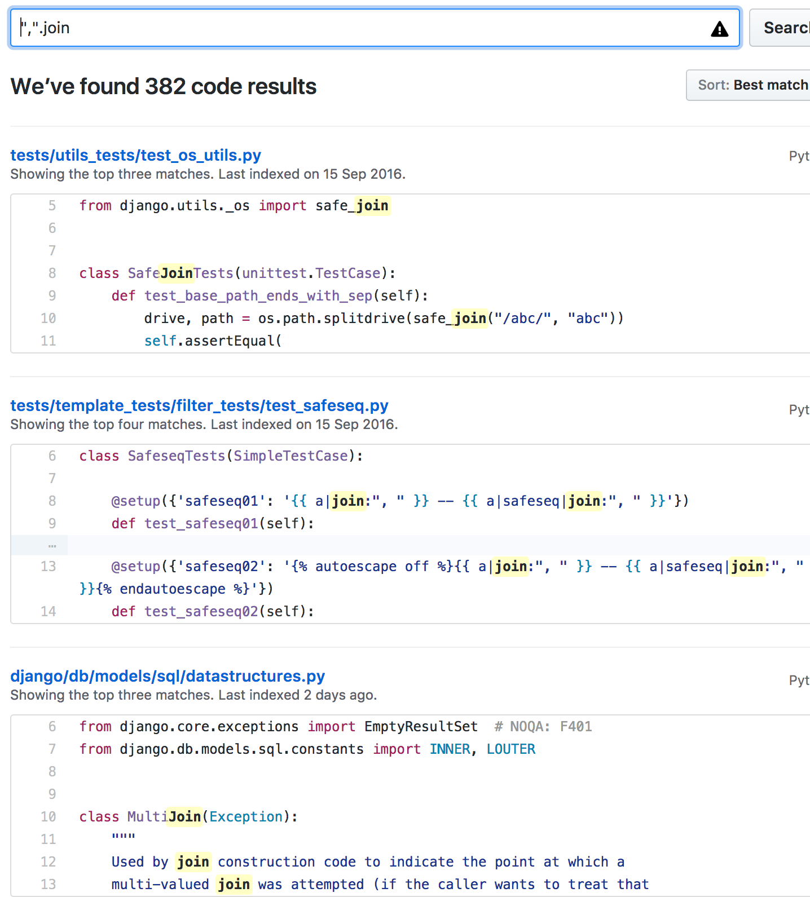
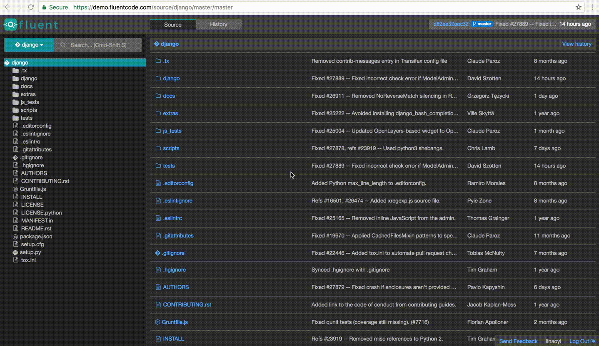
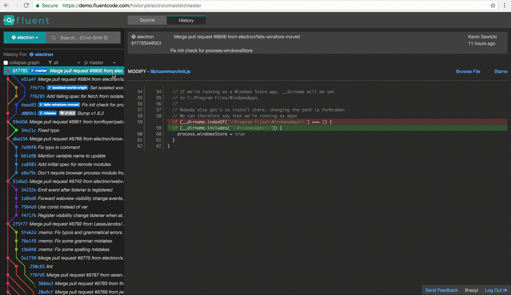

Platforms like [Github], [Bitbucket], and [Phabricator] all provide ways of 
browsing and searching your project's source code online, as part of their 
larger suite of collaboration features. While their overall platform is rich
and valuable, my experience with their online code-explorers has always been 
mediocre and underwhelming.
 
This post contrasts the experience of exploring code online with that using
offline tools, that many would already be familiar with. How exactly is the 
online browsing experience inferior? Why is that the case? And is it possible
to do better? What would "better" look like?

[BitBucket]: https://bitbucket.org/product
[Phabricator]: https://www.phacility.com/
[Fluent]: http://www.fluentcode.com/
[Hound]: https://github.com/etsy/hound
[Github]: https://github.com/
[LiveGrep]: https://livegrep.com/search/linux
[OpenGrok]: http://opengrok.libreoffice.org/

-------------------------------------------------------------------------------

There are many reasons someone would want to explore code online: 

- You are looking through the sources of a library you're using, but 
  are not actively working on. 

- Your editor's search isn't very good, or is unable to handle the size of your
  codebase, possibly in the millions or tens-of-millions of lines.

- You want to send someone a link to a piece of code to discuss: in chat,
  on mailing lists, or in external documentation or design docs

Online code editors have so far not taken off, outside of specific niches. It's 
likely that the people will always be doing "serious work" in offline, local
editors. Nevertheless, there will always be a place for an online code explorer
that provides a place you can "go to" to look at and begin understanding a 
codebase.

## The Status Quo 

In this section, we'll compare Github, which
is reasonably representative of the online code explorers that are available,
to example offline tools to see what the difference is.
 
### Browsing

Browsing through source on e.g. Github works, but is slow and clunky,
generally inferior (Left) to browsing in e.g. Sublime Text (Right).
 
-------------------------------------------------------------------------------

    
    

-------------------------------------------------------------------------------

As you can see, in Sublime, you can click through the files of your project 
instantly, and you can see the entire structure of your project on the left
while you find your way around it. In Github, clicking through files and 
folders is comparatively slow, and it's easy to lose track of where you are.
To some extent, tools like [Octotree] mitigate this, but the online browsing
and reading experience still doesn't match what you would be used to offline.

[Octotree]: https://chrome.google.com/webstore/detail/octotree/bkhaagjahfmjljalopjnoealnfndnagc

### Searching

Similarly, searching for things on Github and other code-hosting platforms is
slow, and not very accurate:

In this case, you can't even find the usages of a trivial string of text, 
because Github search does not support special characters. Furthermore, just
the act of searching pulls you away from the code you were 
[Browsing](#browsing) before, which is likely the code you were trying to 
understand when you searched for something in the first place! And clicking 
into any individual search result again pulls you away from the search results 
you were likely skimming before. Overall, this makes it hard to use search to
augment your reading-of-code: searching, and investigating each result, makes
you immediately lose sight and context of the code you were trying to read.

Searching through your repositories with [Hound] or [LiveGrep] is very fast, 
and precise. But after you find something, it forwards you to a Github URL to 
view the code. That means if you want to explore the code and files surrounding 
the result you found (a common thing to do if you want to properly understand 
it) you are again stuck using Github's slow online code browser, or poking 
around in your editor/console to make sure you're on the right branch looking 
at the right version of the right file.

### History

Apart from having a mediocre view of the *current* code, most online services
like Github also do not have a good way of browsing and visualizing your Git
history. The UI is slow and clunky for performing basic tasks, such a scrolling 
through more than 30 commits. This is clear when you compare Github (Left) to 
offline tools like SourceTree (Right):
 
-------------------------------------------------------------------------------

    
    

-------------------------------------------------------------------------------
 
SourceTree, for all its weaknesses
does a pretty good job at letting you see what commits are in your history,
and what's in them. Github on the other hand punishes you with a 5-second page 
load every 30 commits you want to load, no need to reload the entire page just 
to see what's in a commit. It's fast and convenient.

--------------------------------------------------------------------------------

While in these examples I used Github as the baseline, other online code hosts
like BitBucket or Phabricator have similarly slow, clunky code explorers.

The UI of online tools has more "styling", but none of them 
provide a compelling online code-explorer, certainly
not one that reaches the convenience of exploring code using offline tools. As
I've shown in the above gifs, the experience reading code online is slower and 
clunkier than that working with offline tools. Many common tasks:

- Clicking open some files to see what's inside
- Searching for literal snippets of text 
- Looking at the 31st commit in your history 

Are all slow and tedious affairs.

Why are all existing online code explorers such poor experiences? I would 
argue due to a few reasons:

- These companies provide a hundred and one other features; the online code 
  browser is only one of them, so it doesn't get that much attention
  
- These online code explorers are websites *first*, and prettied up second,
  rather than being built from the ground up to match the quality of the 
  offline experience

There are other tools in this space: things like [LiveGrep], [Hound] or 
[OpenGrok], which provide fast search, but not much else. There are online 
editors and development environments like [CodeAnywhere], which attempt to 
port the entire development environment into the cloud. None of these really
satisfy the need of a convenient, zero-setup way to open a page and read and 
understand source code, online.

[CodeAnywhere]: https://codeanywhere.com/

Why should people going to any project on Github and wanting to look around not 
have as good an experience as those who are working on the project directly? 

My own attempt at answering this question is the [Fluent] code explorer.

## The Fluent Code Explorer

Fluent is an online code explorer that allows you to browse and search code
online as easily and seamlessly as you would using your offline tools.

Rather than being slow and clunky like Github and similar websites, Fluent is
lightning fast to operate and feels just as comfortable as offline tools like 
Sublime Text when it comes to finding your way around the project. You can try 
out our [online demo](https://demo.fluentcode.com/) if you want to poke around 
and get a feel for what Fluent does.

Similarly, Fluent lets you quickly and easily visualize and dig through the 
commit history of a project:

Letting you easily browse through a handful, hundreds or hundreds of thousands
of commits as easily as you would offline, far more easily than clicking 
through 30-commits at a time in the online UIs of Github or its competitors. 

Apart from browsing through code file-by-file, another common use case is 
searching through large amounts of code for keywords or snippets of code. This
is useful to quickly get a feel of what exists in the codebase, and where 
functions and modules are defined or used. Even when you are working offline
in your own IDE or editor, searching for things is one of the most common
actions when trying to understand code.

Most code hosting services on the web have mediocre search functionality. 
Github, as described earlier, has a relatively slow experience along with
odd limits like not letting you search for punctuation. Fluent lets you search 
and have results pop up instantly, even before you're
finished typing. Furthermore, you can easily navigate to any of the search
results without reloading the page and losing track of what you were searching
for.

While Github allows you to search source 
code, it does so in a disruptive way that refreshes your page and yanks you 
away from the code you were previously looking at. It cannot search for special
characters that are common in source code: things like `{`s or `.`s or `"`s, 
and it does provide the as-you-type immediate feedback and results that Fluent
does, which lets you tweak your search queries to find exactly what you want.

A fast code explorer is a useful tool in an engineering organization: it makes
code available for anyone to read and understand, not just the ones who happen
to have the specific repository downloaded and and set up. It provides a way 
to quickly search for code that's more user-friendly than searching at the 
command line, and provides a consistent way for anyone to link to snippets of 
code in online discussions or documentation.

It's not easy to provide an online code explorer that compares well with 
offline tools, especially one that maintains its performance while scaling up 
to large repositories like the [Linux Kernel] or [IntelliJ-IDEA] with tens to
hundreds of thousands of files and commits. Fluent nonetheless manages to 
achieve this, providing an online experience as fast and seamless as any 
offline editor or IDE.

[Linux Kernel]: https://demo.fluentcode.com/source/linux/master/master
[IntelliJ-IDEA]: https://demo.fluentcode.com/source/intellij-community/master/master

--------------------------------------------------------------------------------

The goal of Fluent is to improve the state of code reading online. There really
is no reason why everyone who is hosting code online, whether through Github,
Phabricator, or some other site, should not have their code immediately 
accessible and comfortably browseable by anyone who happens upon their project. 
No reason why companies, which often have teams of engineers discussing and 
collaborating on their codebase, should not have an online place where anyone 
can go to look at the current state of the code, or reference when discussing
code online or in documentation. While Github and friends are definitely a 
marked improvements over their predecessors like [SourceForge] and [Google Code],
there is still a ways to go to bring online code-exploration from "ok" to 
"great".

[Google Code]: https://code.google.com/
[SourceForge]: https://sourceforge.net/

Fluent is currently offered as a self-hosted, standalone 
[installation](http://install.fluentcode.com/). 
Rather than having to ship your code to our servers, and trusting us to take 
care of it, you can run Fluent on your own server and ensure your code never 
leaves your VPN. On top of that you can configure email or Google/Github 
single-sign on if you want to further control who is allowed to access it. 

We are currently offering Fluent as a free product for small teams; anyone who
wishes to use it can use Fluent for up to 30 users, without needing a license 
key. If you are a larger organization who is looking for an online code 
explorer, we'll be happy to work with you to set up Fluent and make it work for 
your engineers.

Eventually we may start offering it as a service anyone can plug into their
Github repositories, public or private, and host on our own servers, but that
is not yet available.

If you're curious, [try out our demo](https://demo.fluentcode.com/),
[install it yourself](http://install.fluentcode.com/) to see how it works with
your own repositories and codebase, and [contact us](http://www.fluentcode.com/free-trial)
if you'd like to use Fluent for a larger team with more than 30 people! 
