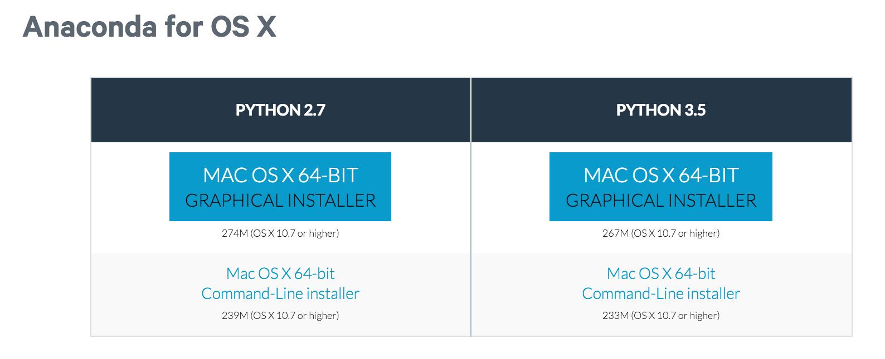
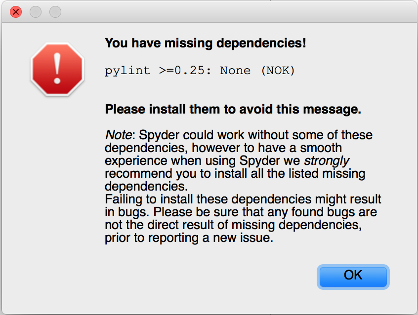
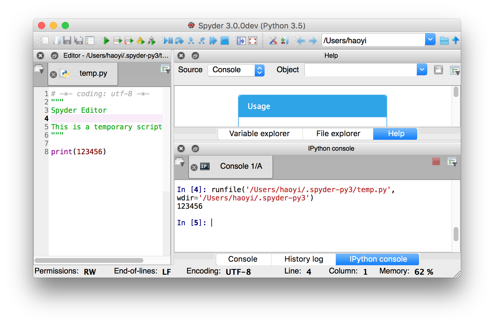
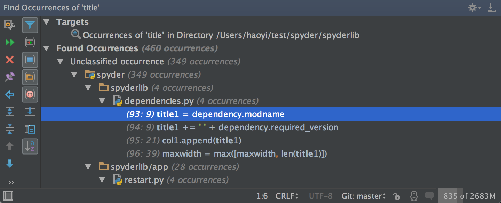
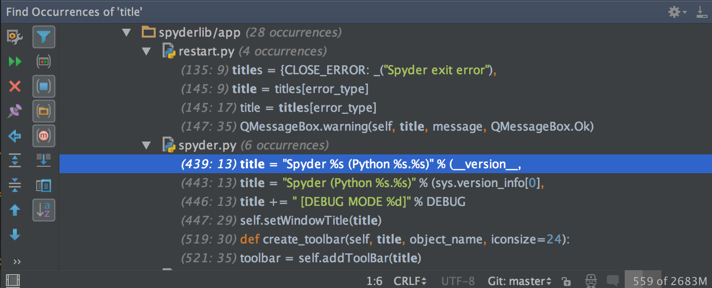
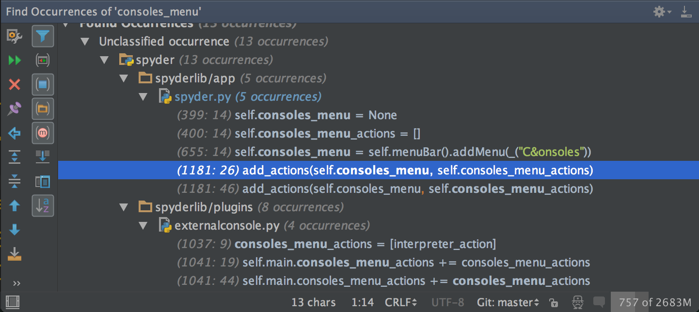
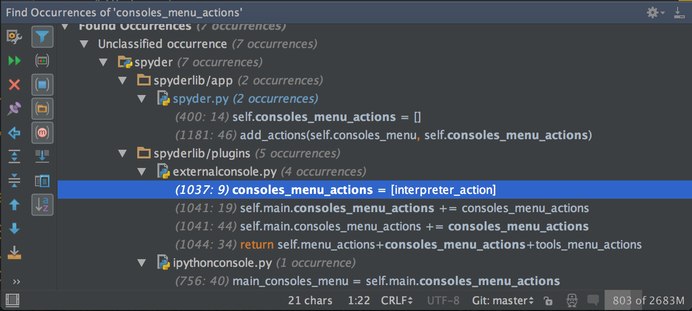
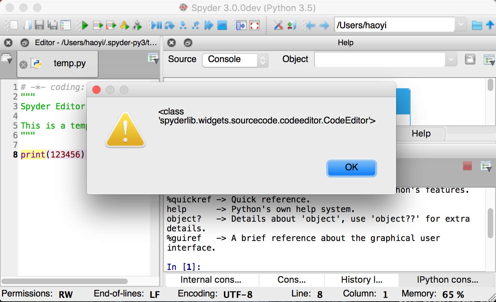
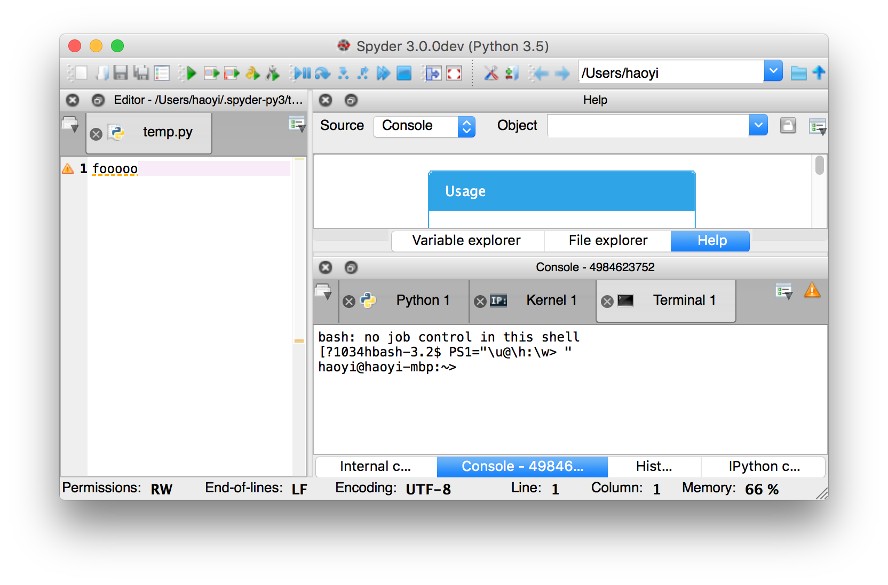
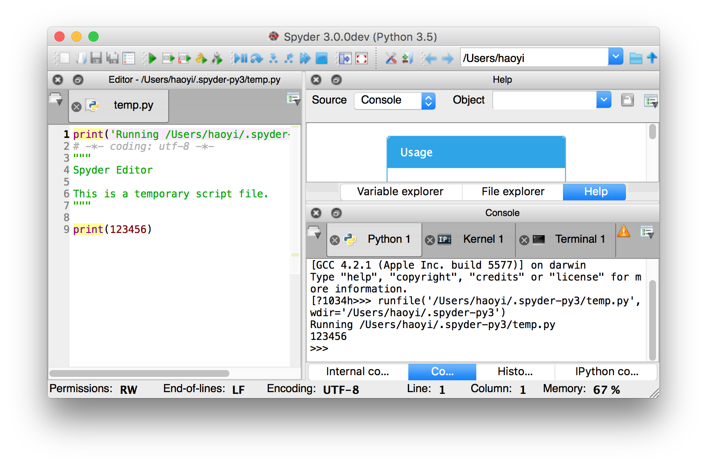

This post will walk you through an exercise in diving into someone else's
code. The goal will be to make an arbitrary change to the code of the 
[Spyder Python IDE], a project I have never touched before in my life, and 
learn *just* enough about it to accomplish what I want without getting bogged 
down. You will learn how to approach problems without the rigour taught in 
formal education, and instead with guesswork, experimentation, and insight 
learned in a professional environment. You will see first-hand the joys, 
sorrows and frustrations trying to navigate the project, culminating in a 
working (if rough) patch adding a feature to a large, unfamiliar codebase.

Everyone who learns programming has written a pile of code in a bunch
of different programs: whether it's implementing algorithms for problem sets,
building websites, or making video games. Being a 
professional software engineer, on the other hand, very often does *not* 
involve *"writing lots of code"*! More often, you spend your time 
spelunking deep into other peoples code: code you do not understand, did not 
write, and have possibly never seen before in your life. You have no-one to 
ask for help, no-one to hear you scream, and yet you have to make forward 
progress.
 
[Spyder Python IDE]: https://github.com/spyder-ide/spyder#spyder---the-scientific-python-development-environment

-------------------------------------------------------------------------------

## Goal

The goal of this post is to dive into a codebase we've never seen before 
and make some non-trivial changes to it. The target of this exercise is going to
be the [Spyder Python IDE]. According to the Github page, it looks something
like:


Our (arbitrary) goal is going to add a new dropdown menu next to the `Help`
dropdown called `Misc`, and inside there is going to be a menu-item/command
that takes the currently opened text area and prepends the code:

```python
print("Running %s" % __name__)
```

At the top to indicate when a file starts executing.

I have worked with Python and Javascript professionally for several years now, 
and am deeply familiar with the ecosystems around both. I'm also
experienced working in Linux environments, with the Bash command-line, and have 
done a lot of open-source Scala as well as some Java/C#/PHP in the ancient past. 
Nevertheless, I have never used the Spyder editor or touched its codebase in 
any way, nor have I ever really seen it before today. This exercise will 
explore how you attack such a codebase from a position of total ignorance and
make progress despite your continued partial ignorance.

## Strategy

Here's the order of business approaching an unknown codebase like this:

- [Exposure](#exposure): browse the docs to get a high-level overview of what 
  the project is/does 
- [Installation](#installation): get the project running locally, no matter 
  what it takes
    - [Anaconda](#anaconda)
    - [Back to Spyder](#back-to-spyder)
    - [PyQt5 to PySide](#pyqt5-to-pyside)
    - [Back to PyQt5](#back-to-pyqt5)
- [Familiarization](#Familiarization): leaf through the codebase at-large to 
  see roughly what's where
    - [Touring the Code](#touring-the-code)
    - [Spyderlib](#spyderlib)
- [Hello World](#hello-world): tweak something small and make sure it affects 
  the running code
- [Iteration](#iteration): keep fiddling with the code to get more and more stuff working
    - [Rolling in Mud](#rolling-in-mud)
    - [Our own Action](#our-own-action)
    - [Endgame: the Editor](#endgame-the-editor)
- [Conclusion](#conclusion)

When working with Other People's Code, there are several things to keep in 
mind:

- You have to know what the project does. In this case it seems to be some
  sort of graphical IDE for scientific [Python](https://www.python.org/), which 
  is great: I know what an IDE is, and what Python is, even though I've never 
  used *scientific* Python. If it's another project with more specialized 
  usage, make sure you know what it's *meant* to do before diving in.
  
- The code probably works. If the project is abandoned, or hasn't seen activity
  in a while, it might not, but Spyder had its last commit 
  [two days ago](https://github.com/spyder-ide/spyder/commit/3f4b5121f99f6aec1e70dba4151e07ea311cda27)
  so you can be reasonably sure someone is working on it and it's working 
  enough for them to make changes

- There has to be *some* way of setting it up for "development": making code
  changes and seeing them work, or not. This is probably distinct from the 
  "bundle everything up for distribution" mode.
  
- It *has to be possible** to set it up. If the project is old, abandoned or 
  built by a single person this might not be true, as it might require special
  preparation that only existed on the original developer's laptop. This one
  on the other hand seems actively developed by multiple people, so even if 
  setup proves to be a pain in the neck, we at least know it's *possible*.
  
- It's ok if it takes time to get set up. "Several days" to get set up isn't 
  uncommon in professional settings which have sprawling messes of code, even 
  if it is a bit long. "A few hours" is probably reasonable: my first 
  installation of [PHP](https://en.wikipedia.org/wiki/PHP) + 
  [MySQL](https://www.mysql.com/) took 9 hours. Ideally you'd
  be able to get set up with a development environent in seconds, like you
  can with the [IPython](https://github.com/ipython/ipython) project, but
  not every project lucky enough to be so self-contained and dependency-free.

## Exposure

If you have no idea what a project is or does, you have no hope of trying to 
make changes to it. In this case, we are looking at the [Spyder Python IDE]:


This is a Python IDE that is written *for* Python, *in* Python, as can be seen
from the breakdown on the github page:


At first glance, it has a code editor on the left, a 
[IPython REPL](https://github.com/ipython/ipython) in the bottom right (you can
tell rom the tell-tale `In [1]` syntax) which supports graphical output similar
to IPython's [Notebooks](http://ipython.org/notebook.html), and a documentation
browser in the top-right. Otherwise it looks like a pretty typical IDE: buttons
at the top to save/load/copy/run/debug/step-through your code, with drop-down 
menus holding lots more functionality, a tabbed text editor with syntax 
highlighting and other things.

Spyder seems to run on basically any platform: the docs include instructions
for [basically all version of Windows](http://pythonhosted.org/spyder/installation.html#installing-on-windows-vista-7-8-10),
[Mac OS-X](http://pythonhosted.org/spyder/installation.html#installing-on-macos-x),
and [Linux](http://pythonhosted.org/spyder/installation.html#installing-on-linux) 
(Ubuntu, Debian, Arch, Fedora, ...)

It seems like a reasonably old (several years), reasonably active project with 
a good number of contributors:


So it's not just a one-man fly-by-night show. It's not entirely clear whether 
there's a commercial entity backing it or not.

That's a quick overview of what Spyder appears to be to an un-initiated 
outsider. Let's try to get Spyder working on our Macbook!

## Installation

The first thing you want to do when you decide you want to try out a project 
is figure out how you can install it in "development mode": usually projects
will have a nice, all-included, encapsulated distribution that is convenient
to download for end-users working *within* that project, but not the same as 
what a person working *on* that project would want to use. In the case of 
Spyder, this appears to be the distinction between the two sections:

- [Installation](https://github.com/spyder-ide/spyder#installation)
- [Running from Source](https://github.com/spyder-ide/spyder#running-from-source)

If I was an end-user who just wanted an IDE, I would use the **Installation** 
instructions. But since I'm interested in modifying Spyder rather than just
using it, I will start with **Running from Source**. This is always harder,
less convenient and more time-consuming than using the "packaged" distribution.
Nonetheless, if you are at all interested in making changes to the code, you
will need to get over this hump eventually so might as well get over it now.

As is common, the first thing you need to do is download dependencies. Spyder
is not developed in a vacuum, and under the section on 
[Dependencies](https://github.com/spyder-ide/spyder#dependencies) we see:

> - **Python** 2.7 or 3.3+
> - **PyQt5** 5.2+ or **PyQt4** 4.6+: PyQt5 is recommended.
> - **qtconsole**: Enhanced Python interpreter.
> - **Rope** and **Jedi**: Editor code completion, calltips and go-to-definition.
> - **Pyflakes**: Real-time code analysis.
> - **Sphinx**: Rich text mode for the Help pane.
> - **Pygments**: Syntax highlighting for all file types it supports.
> - **Pylint**: Static code analysis.
> - **Pep8**: Style analysis.
> - **Psutil**: CPU and memory usage on the status bar.
> - **Nbconvert**: Manipulation of notebooks in the Editor.
> - **Qtawesome**: To have an icon theme based on FontAwesome.
> - **Pickleshare**: Show import completions on the Python consoles.
> - **PyZMQ**: Run introspection services asynchronously.

That's quite a long list! I know what Python is, but I have no idea what the
rest of these things seem to be. In principle, I could go and install each of
these dependencies one by one using [pip](http://python-packaging-user-guide.readthedocs.org/en/latest/installing/), 
Python's package manager, but 
I also notice at the top of the **Dependencies** section is a little 
disclaimer:

- **Important** note: Most if not all the dependencies listed below come with 
  Anaconda, WinPython and Python(x,y), so you don't need to install them 
  separately when installing one of these Scientific Python distributions.
  
It seems there's a single bundle I can download to install it all! I've never
used any of these "Scientific Python Distributions" before, but I've heard of 
them: they're a pre-packaged Python download that comes complete with a bunch
of useful libraries included. In this case, Spyder is telling us that any of 
these pre-packaged downloads should have everything we need. Thus, the next 
step in our quest is to go and download one of them to try out, starting with
Anaconda 
 
### Anaconda

I'm on a Macbook Pro running OS-X, and Googling "Anaconda OS-X" takes me right 
to the download page:


The installation page seems to start off with **Get Superpowers with Anaconda**
which seems totally meaningless to me, so let's ignore that. There's also an
**OS-X** link, so let's follow that, which brings us to the installer download:



For now, I'm going to go with the command-line download for Python 3.5 instead
of Python 2.7. Below the download link, there are instructions to get started:

> **Command Line Installer**:
>
> 1. Download the command line installer.
> 2. In your terminal window, type one of the below and follow the instructions:
>    **Python** 2.7:
>    `bash Anaconda2-2.5.0-MacOSX-x86_64.sh`
>    **Python** 3.5:
>    `bash Anaconda3-2.5.0-MacOSX-x86_64.sh`
>    NOTE: Include the "bash" command even if you are not using the bash shell.
> 3. Optional: Verify data integrity with MD5.
 
Anaconda is a big install (>200mb!) and takes 3-4 minutes to download. Running 
the installer in the command-line as instructed starts off a 
several-minute-long download-and-install process:

```python
$ bash ../Downloads/Anaconda3-2.5.0-MacOSX-x86_64.sh

Welcome to Anaconda3 2.5.0 (by Continuum Analytics, Inc.)

In order to continue the installation process, please review the license
agreement.
Please, press ENTER to continue
>>>
================
Anaconda License
================
...
```

Which, after entering `yes` or `ENTER` to a bunch of questions it asks you,
seems to end with:

```python
...
Prepending PATH=/Users/haoyi/anaconda3/bin to PATH in
newly created /Users/haoyi/.bash_profile

For this change to become active, you have to open a new terminal.

Thank you for installing Anaconda3!

Share your notebooks and packages on Anaconda Cloud!
Sign up for free: https://anaconda.org
```
 
It turns out that immediately running `anaconda` doesn't seem to work, 
and the `python3` command is unchanged:

```python
haoyi-mbp:test haoyi$ anaconda
-bash: anaconda: command not found

haoyi-mbp:test haoyi$ python3
Python 3.4.2 (default, Feb 10 2015, 03:38:22)
[GCC 4.2.1 Compatible Apple LLVM 6.0 (clang-600.0.56)] on darwin
Type "help", "copyright", "credits" or "license" for more information.
>>>
```

Which is probably expected, since the install printouts tell us it only works
when you open a new terminal. So opening a new terminal and running `anaconda`,
we get:

```
haoyi-mbp:~ haoyi$ anaconda
usage: anaconda [-h] [--show-traceback] [--hide-traceback] [-v] [-q] [--color]
                [--no-color] [-V] [-t TOKEN] [-s SITE]
                ...
anaconda: error: A sub command must be given. To show all available sub commands, run:

	 anaconda -h

```

No clue what *that* is, but I guess we installed something! Running `python3` 
now, we get

```
$ python3
Python 3.5.1 |Anaconda 2.5.0 (x86_64)| (default, Dec  7 2015, 11:24:55)
[GCC 4.2.1 (Apple Inc. build 5577)] on darwin
Type "help", "copyright", "credits" or "license" for more information.
>>>
```

With the `Anaconda` in the introductory banner, it seems we've installed 
Anaconda successfully! As for the last step "Verify data integrity with MD5",
let's just [YOLO](http://tinyurl.com/htep7tk) it for now.

### Back to Spyder

Now that Anaconda is sorted out, let's go back to the 
[Running from Source](https://github.com/spyder-ide/spyder#running-from-source)
part of the documentation. Directly underneath the header, before all that talk
of dependencies, we see

> The fastest way to run Spyder is to get the source code using git, install PyQt5 
> or PyQt4, and run these commands:
>  
> 1. Install our runtime dependencies (see below).
> 2. `cd /your/spyder/git-clone`
> 3. `python bootstrap.py`
> 
> You may want to do this for fixing bugs in Spyder, adding new features, 
> learning how Spyder works or just getting a taste of it.

I guess it expects us to have cloned the Spyder repository in order to `cd` 
into it. Let's do that using the URL listed on the Github page:


```python
$ git clone git@github.com:spyder-ide/spyder.git
Cloning into 'spyder'...
remote: Counting objects: 43311, done.
remote: Compressing objects: 100% (393/393), done.
remote: Total 43311 (delta 263), reused 0 (delta 0), pack-reused 42918
Receiving objects: 100% (43311/43311), 28.27 MiB | 3.53 MiB/s, done.
Resolving deltas: 100% (33096/33096), done.
Checking connectivity... done.
```

If anyone wants to follow along, the commit at-time-of-writing is

- [df9577cfc279d2b6f2c07c7ba4e8e7aebfdd1835](https://github.com/spyder-ide/spyder/commit/df9577cfc279d2b6f2c07c7ba4e8e7aebfdd1835)

And then `cd`ing into it and running it:

```python
$ python3 bootstrap.py
Executing Spyder from source checkout
Revision df9577c, Branch: master
01. Patched sys.path with /Users/haoyi/test/spyder
02. No PyQt5 or PyQt4 detected, using PySide if available (deprecated)
Traceback (most recent call last):
  File "/Users/haoyi/test/spyder/spyderlib/qt/__init__.py", line 62, in <module>
    from PySide import __version__  # analysis:ignore
ImportError: No module named 'PySide'

During handling of the above exception, another exception occurred:

Traceback (most recent call last):
  File "bootstrap.py", line 140, in <module>
    versions = get_versions(reporev=False)
  File "/Users/haoyi/test/spyder/spyderlib/__init__.py", line 65, in get_versions
    import spyderlib.qt
  File "/Users/haoyi/test/spyder/spyderlib/qt/__init__.py", line 65, in <module>
    raise ImportError("Spyder requires PyQt5, PyQt4 or PySide (deprecated) "
ImportError: Spyder requires PyQt5, PyQt4 or PySide (deprecated) to be installed
$
```

I guess when the docs said "Most if not all the dependencies listed below 
come with *Anaconda*..." it was definitely a *most* and not an *all*. No 
matter, let's install PyQt5 (listed on the github readme as "recommended")
using `pip3`, the Python 3 version of `pip` that should correspond with the
`python3` executable that came with Anaconda:

### PyQt5 to PySide

```python
$ pip3 install PyQt5
You are using pip version 6.0.8, however version 8.1.0 is available.
You should consider upgrading via the 'pip install --upgrade pip' command.
Collecting PyQt5
  Could not find any downloads that satisfy the requirement PyQt5
  No distributions at all found for PyQt5
$
```

Nope? Googling for "pip install PyQt5" gives:

- http://stackoverflow.com/questions/21577723/why-cant-i-install-pyqt5-from-the-pypi

Which makes it appear like you can't install this library from PyPI using pip.
Googling "osx pyqt5" gives:

- https://gist.github.com/vityafx/e01ab56d28a2c9467cc6
 
It appears there isn't any way to install PyQt5 easily without having to do a 
whole bunch of manual `tar`ing and `make`ing at the command line. On the other 
hand, the error message earlier said that the 
[PySide](http://pyside.readthedocs.org/en/latest/) module was deprecated, 
but it might still work! For now, I don't care about deprecation warnings, I 
just want to get something (*anything*) that works. Googling "pip install 
pyside" finds a page for that module on the standard module repository:
 
- https://pypi.python.org/pypi/PySide/1.2.4

Trying to install that using `pip3` seems to work initially, but then fails
with

```python
$ pip3 install PySide
You are using pip version 6.0.8, however version 8.1.0 is available.
You should consider upgrading via the 'pip install --upgrade pip' command.
Collecting PySide
  Downloading PySide-1.2.4.tar.gz (9.3MB)
    100% |################################| 9.3MB 69kB/s
    Removing /private/var/folders/xw/4lw_p32d0pg88hyg5rfn7vqxqhkgj_/T/pip-build-8_5xp5w9/PySide/pyside_package
    package init file 'pyside_package/PySide/__init__.py' not found (or not a regular file)
    package init file 'pyside_package/pysideuic/__init__.py' not found (or not a regular file)
Installing collected packages: PySide
  Running setup.py install for PySide
    Removing /private/var/folders/xw/4lw_p32d0pg88hyg5rfn7vqxqhkgj_/T/pip-build-8_5xp5w9/PySide/pyside_package
    Python architecture is 64bit
    error: Failed to find cmake. Please specify the path to cmake with --cmake parameter.
    Complete output from command /usr/local/opt/python3/bin/python3.4 -c "import setuptools, tokenize;__file__='/private/var/folders/xw/4lw_p32d0pg88hyg5rfn7vqxqhkgj_/T/pip-build-8_5xp5w9/PySide/setup.py';exec(compile(getattr(tokenize, 'open', open)(__file__).read().replace('\r\n', '\n'), __file__, 'exec'))" install --record /var/folders/xw/4lw_p32d0pg88hyg5rfn7vqxqhkgj_/T/pip-ugoc2jah-record/install-record.txt --single-version-externally-managed --compile:
    Removing /private/var/folders/xw/4lw_p32d0pg88hyg5rfn7vqxqhkgj_/T/pip-build-8_5xp5w9/PySide/pyside_package

    running install

    running build

    Python architecture is 64bit

    error: Failed to find cmake. Please specify the path to cmake with --cmake parameter.

    ----------------------------------------
    Command "/usr/local/opt/python3/bin/python3.4 -c "import setuptools, tokenize;__file__='/private/var/folders/xw/4lw_p32d0pg88hyg5rfn7vqxqhkgj_/T/pip-build-8_5xp5w9/PySide/setup.py';exec(compile(getattr(tokenize, 'open', open)(__file__).read().replace('\r\n', '\n'), __file__, 'exec'))" install --record /var/folders/xw/4lw_p32d0pg88hyg5rfn7vqxqhkgj_/T/pip-ugoc2jah-record/install-record.txt --single-version-externally-managed --compile" failed with error code 1 in /private/var/folders/xw/4lw_p32d0pg88hyg5rfn7vqxqhkgj_/T/pip-build-8_5xp5w9/PySide
```

Trying to run `cmake` indicates it doesn't exist:

```python
$ cmake
-bash: cmake: command not found
```

Maybe we can just install `cmake` using our package manager 
([brew](http://brew.sh/)) and it'll be happy? Let's try `brew install cmake`...

```python
$ brew install cmake
==> Downloading http://www.cmake.org/files/v3.1/cmake-3.1.2.tar.gz
######################################################################## 100.0%
==> Downloading https://pypi.python.org/packages/source/S/Sphinx/Sphinx-1.2.3.tar.gz
######################################################################## 100.0%
==> python -c import setuptools... --no-user-cfg install --prefix=/private/tmp/cmake-Kp5igT/cmake-3.1
==> Downloading https://pypi.python.org/packages/source/d/docutils/docutils-0.12.tar.gz
######################################################################## 100.0%
==> python -c import setuptools... --no-user-cfg install --prefix=/private/tmp/cmake-Kp5igT/cmake-3.1
==> Downloading https://pypi.python.org/packages/source/P/Pygments/Pygments-2.0.2.tar.gz
######################################################################## 100.0%
==> python -c import setuptools... --no-user-cfg install --prefix=/private/tmp/cmake-Kp5igT/cmake-3.1
==> Downloading https://pypi.python.org/packages/source/J/Jinja2/Jinja2-2.7.3.tar.gz
######################################################################## 100.0%
==> python -c import setuptools... --no-user-cfg install --prefix=/private/tmp/cmake-Kp5igT/cmake-3.1
==> Downloading https://pypi.python.org/packages/source/M/MarkupSafe/MarkupSafe-0.23.tar.gz
######################################################################## 100.0%
==> python -c import setuptools... --no-user-cfg install --prefix=/private/tmp/cmake-Kp5igT/cmake-3.1
==> ./bootstrap --prefix=/usr/local/Cellar/cmake/3.1.2 --system-libs --parallel=8 --no-system-libarch
==> make
==> make install
/usr/local/Cellar/cmake/3.1.2: 1821 files, 29M, built in 5.1 minutes
```

After 5 long and painful minutes, it seems to have worked! And now the `cmake` 
command prints something:

```python
$ cmake
Usage

  cmake [options] <path-to-source>
  cmake [options] <path-to-existing-build>

Specify a source directory to (re-)generate a build system for it in the
current working directory.  Specify an existing build directory to
re-generate its build system.

Run 'cmake --help' for more information.
```

Let's try `pip3 install PySide` again...

```python
$ pip3 install PySide
You are using pip version 6.0.8, however version 8.1.0 is available.
You should consider upgrading via the 'pip install --upgrade pip' command.
Collecting PySide
  Using cached PySide-1.2.4.tar.gz
    Removing /private/var/folders/xw/4lw_p32d0pg88hyg5rfn7vqxqhkgj_/T/pip-build-dx05oahd/PySide/pyside_package
    package init file 'pyside_package/PySide/__init__.py' not found (or not a regular file)
    package init file 'pyside_package/pysideuic/__init__.py' not found (or not a regular file)
Installing collected packages: PySide
  Running setup.py install for PySide
    Removing /private/var/folders/xw/4lw_p32d0pg88hyg5rfn7vqxqhkgj_/T/pip-build-dx05oahd/PySide/pyside_package
    Python architecture is 64bit
    error: Failed to find qmake. Please specify the path to qmake with --qmake parameter.
    Complete output from command /usr/local/opt/python3/bin/python3.4 -c "import setuptools, tokenize;__file__='/private/var/folders/xw/4lw_p32d0pg88hyg5rfn7vqxqhkgj_/T/pip-build-dx05oahd/PySide/setup.py';exec(compile(getattr(tokenize, 'open', open)(__file__).read().replace('\r\n', '\n'), __file__, 'exec'))" install --record /var/folders/xw/4lw_p32d0pg88hyg5rfn7vqxqhkgj_/T/pip-ln1fsrej-record/install-record.txt --single-version-externally-managed --compile:
    Removing /private/var/folders/xw/4lw_p32d0pg88hyg5rfn7vqxqhkgj_/T/pip-build-dx05oahd/PySide/pyside_package

    running install

    running build

    Python architecture is 64bit

    error: Failed to find qmake. Please specify the path to qmake with --qmake parameter.

    ----------------------------------------
    Command "/usr/local/opt/python3/bin/python3.4 -c "import setuptools, tokenize;__file__='/private/var/folders/xw/4lw_p32d0pg88hyg5rfn7vqxqhkgj_/T/pip-build-dx05oahd/PySide/setup.py';exec(compile(getattr(tokenize, 'open', open)(__file__).read().replace('\r\n', '\n'), __file__, 'exec'))" install --record /var/folders/xw/4lw_p32d0pg88hyg5rfn7vqxqhkgj_/T/pip-ln1fsrej-record/install-record.txt --single-version-externally-managed --compile" failed with error code 1 in /private/var/folders/xw/4lw_p32d0pg88hyg5rfn7vqxqhkgj_/T/pip-build-dx05oahd/PySide
```

What on earth is `qmake`??? I certainly can't `brew install` it:

```python
$ brew install qmake
Error: No available formula for qmake
Searching formulae...
Searching taps...
```

Googling `pyside qmake osx` gives:

- http://pyside.readthedocs.org/en/latest/building/macosx.html


It tells us to install [Xcode](https://developer.apple.com/xcode/), which I 
already have from earlier. After that, there's this magic command.

```
brew install python qt
```

We've already just installed `cmake`, and have `python` installed as part of
the whole Anaconda thing earlier. I guess we just need [qt](http://www.qt.io/) 
to make the `qmake` command available. `brew install qt`...

```python
$ brew install qt
==> Downloading https://download.qt.io/official_releases/qt/4.8/4.8.6/qt-everywhere-opensource-src-4.

curl: (22) The requested URL returned error: 403 Forbidden
Trying a mirror...
==> Downloading http://qtmirror.ics.com/pub/qtproject/official_releases/qt/4.8/4.8.6/qt-everywhere-op
######################################################################## 100.0%
==> Downloading https://raw.githubusercontent.com/DomT4/scripts/440e3cafde5bf6ec6f50cd28fa5bf89c280f1
######################################################################## 100.0%
==> Patching
patching file src/gui/dialogs/qcolordialog_mac.mm
patching file src/gui/dialogs/qfiledialog_mac.mm
patching file src/gui/dialogs/qfontdialog_mac.mm
patching file src/gui/kernel/qapplication_mac.mm
patching file src/gui/kernel/qcocoaapplication_mac.mm
patching file src/gui/kernel/qcocoaapplicationdelegate_mac.mm
Hunk #4 succeeded at 295 (offset -13 lines).
Hunk #5 succeeded at 342 (offset -13 lines).
patching file src/gui/kernel/qcocoaapplicationdelegate_mac_p.h
patching file src/gui/kernel/qcocoamenuloader_mac.mm
patching file src/gui/kernel/qcocoasharedwindowmethods_mac_p.h
patching file src/gui/kernel/qeventdispatcher_mac.mm
patching file src/gui/kernel/qt_cocoa_helpers_mac.mm
patching file src/gui/kernel/qwidget_mac.mm
patching file src/gui/styles/qmacstyle_mac.mm
patching file src/gui/util/qsystemtrayicon_mac.mm
patching file src/gui/widgets/qcocoamenu_mac.mm
patching file src/gui/widgets/qmenu_mac.mm
==> ./configure -prefix /usr/local/Cellar/qt/4.8.6 -system-zlib -qt-libtiff -qt-libpng -qt-libjpeg -c
==> make
2 errors generated.
make[2]: *** [.obj/release-shared/qpaintengine_mac.o] Error 1
make[2]: *** Waiting for unfinished jobs....
make[1]: *** [release] Error 2
make: *** [sub-gui-make_default-ordered] Error 2

READ THIS: http://git.io/brew-troubleshooting
```


Seems like installation timed out or something? Trying to run `qmake` certainly
doesn't work yet. Googling `brew install qt timing out` gives us:

```
https://github.com/Homebrew/homebrew/issues/30843
```

So it seems like it's not just our problem. Maybe running it again will work?
If not we might go back and try installing `PyQt5` again using the long-ish
instructions we found earlier.

It seems to have failed again:

```python
==> ./configure -prefix /usr/local/Cellar/qt/4.8.6 -system-zlib -qt-libtiff -qt-libpng -qt-libjpeg -c
==> make
2 errors generated.
make[2]: *** [.obj/release-shared/qpaintengine_mac.o] Error 1
make[2]: *** Waiting for unfinished jobs....
make[1]: *** [release] Error 2
make: *** [sub-gui-make_default-ordered] Error 2

READ THIS: http://git.io/brew-troubleshooting
```

### Back to PyQt5

Let's give up on PySide for now. I don't know why the installation doesn't work 
but it doesn't. It seems to require `qt` anyway which is probably not that 
different from what `PyQt4` requires.
 
Googling again for "osx PyQt5", I find 
 
- https://pypi.python.org/pypi/pyqt5-macos-built

> This package installs a prebuilt version of PyQt5 for Mac OS. 
> It does not compile anything because uses an already precompiled one. 


I wonder if that would work? Avoiding compilation would certainly avoid the 
what-looks-like-a-compilation-timeout during the `make` command that was 
running while trying to `brew install qt`. Presumably any mechanism of trying
to install `PyQt5` that needs compilation would need `qt` and bump into the
same timeout? Anyway this seems to have installed successfully:

```python
$ pip3 install pyqt5-macos-built
You are using pip version 6.0.8, however version 8.1.0 is available.
You should consider upgrading via the 'pip install --upgrade pip' command.
Collecting pyqt5-macos-built
  Downloading pyqt5-macos-built-5.5.0.tar.gz (5.1MB)
    100% |################################| 5.1MB 124kB/s
    /usr/local/Cellar/python3/3.4.2_1/Frameworks/Python.framework/Versions/3.4/lib/python3.4/distutils/dist.py:260: UserWarning: Unknown distribution option: 'bugtrack_url'
      warnings.warn(msg)
Collecting docopt (from pyqt5-macos-built)
  Downloading docopt-0.6.2.tar.gz
Installing collected packages: docopt, pyqt5-macos-built
  Running setup.py install for docopt
  Running setup.py install for pyqt5-macos-built
    changing mode of build/scripts-3.4/pyqt5_macos_built.py from 644 to 755
    /usr/local/Cellar/python3/3.4.2_1/Frameworks/Python.framework/Versions/3.4/lib/python3.4/distutils/dist.py:260: UserWarning: Unknown distribution option: 'bugtrack_url'
      warnings.warn(msg
    changing mode of /usr/local/bin/pyqt5_macos_built.py to 755
Successfully installed docopt-0.6.2 pyqt5-macos-built-5.5.0
```

Oddly enough, trying to run `python3 bootstrap.py` seems to be failing claiming 
it can't find `PyQt5`, even though in the `python3` repl it imports just fine!
 
```python
$ python3 bootstrap.py
Executing Spyder from source checkout
Revision df9577c, Branch: master
01. Patched sys.path with /Users/haoyi/test/spyder
02. PyQt5 is detected, selecting
Traceback (most recent call last):
  File "/Users/haoyi/test/spyder/spyderlib/qt/__init__.py", line 62, in <module>
    from PySide import __version__  # analysis:ignore
ImportError: No module named 'PySide'

During handling of the above exception, another exception occurred:

Traceback (most recent call last):
  File "bootstrap.py", line 140, in <module>
    versions = get_versions(reporev=False)
  File "/Users/haoyi/test/spyder/spyderlib/__init__.py", line 65, in get_versions
    import spyderlib.qt
  File "/Users/haoyi/test/spyder/spyderlib/qt/__init__.py", line 65, in <module>
    raise ImportError("Spyder requires PyQt5, PyQt4 or PySide (deprecated) "
ImportError: Spyder requires PyQt5, PyQt4 or PySide (deprecated) to be installed
$ python3
Python 3.4.2 (default, Feb 10 2015, 03:38:22)
[GCC 4.2.1 Compatible Apple LLVM 6.0 (clang-600.0.56)] on darwin
Type "help", "copyright", "credits" or "license" for more information.
>>> import PyQt5
>>>
```

Looking at the code performing the import in `spyderlib/qt/__init__.py`:

```python
if API == 'pyqt5':
    try:
        from PyQt5.QtCore import PYQT_VERSION_STR as __version__
        from PyQt5 import uic  # analysis:ignore
    except ImportError:
        API = os.environ['QT_API'] = 'pyqt'
        API_NAME = 'PyQt4'
```

Seems like it's running into an `ImportError` that's resulting in a failure
down below in the same file? We can try running those imports in the `python3` 
REPL, and lo-and-behold they fail:

```python
$ python3
Python 3.4.2 (default, Feb 10 2015, 03:38:22)
[GCC 4.2.1 Compatible Apple LLVM 6.0 (clang-600.0.56)] on darwin
Type "help", "copyright", "credits" or "license" for more information.
>>> from PyQt5.QtCore import PYQT_VERSION_STR as __version__
Traceback (most recent call last):
  File "<stdin>", line 1, in <module>
ImportError: dlopen(/usr/local/lib/python3.4/site-packages/PyQt5/QtCore.so, 2): Library not loaded: /usr/local/opt/qt5/lib/QtCore.framework/Versions/5/QtCore
  Referenced from: /usr/local/lib/python3.4/site-packages/PyQt5/QtCore.so
  Reason: image not found
>>>
```

No luck; even though it seems you can `import PyQt5`, doing 
`from PyQt5.Core import PYQT_VERSION_STR as __version__` seems to blow up. 
Seems like some binary dependency was not properly installed? Maybe the 
`pyqt5-macos-built` package is missing some QT dependency it needs.
 
Googling "Library not loaded QtCore" find us:

- http://stackoverflow.com/questions/25656307/pyside-qt-import-error

Maybe if `brew install qt` doesn't work then `brew install qt5` will???

This seems to be taking forever. It turns out that you can install python
packages through `conda` as well as through `pip`. Googling "Anaconda pyqt5"
gives us

- http://stackoverflow.com/questions/25468397/using-anaconda-python-with-pyqt5

```python
conda config --add channels dsdale24 
conda install pyqt5
```

Which appears not to work due to python3 being *something something* 
incompatible with pyqt5 *something something*. Turns out that the Anaconda 
package for `pyqt5` only works with Python 2.7! 

```python
$ conda info pyqt5
Using Anaconda Cloud api site https://api.anaconda.org
Fetching package metadata: ......

pyqt5 5.3.1 py27_0
------------------
...
```


Luckily `conda` has a lot of useful commands, including a `search` command 
that could help us find something similar that might work:

```python
$ conda
usage: conda [-h] [-V] [--debug] command ...

conda is a tool for managing and deploying applications, environments and packages.

Options:

positional arguments:
  command
    info         Display information about current conda install.
    help         Displays a list of available conda commands and their help
                 strings.
    list         List linked packages in a conda environment.
    search       Search for packages and display their information. The input
                 is a Python regular expression. To perform a search with a
                 search string that starts with a -, separate the search from
                 the options with --, like 'conda search -- -h'. A * in the
                 results means that package is installed in the current
                 environment. A . means that package is not installed but is
                 cached in the pkgs directory.
```

Could it find a version of `pyqt` that would work with Python 3???

```python
$ conda search pyqt
Using Anaconda Cloud api site https://api.anaconda.org
Fetching package metadata: ......
pyqt                         4.10.4                   py26_0  defaults
                             4.10.4                   py27_0  defaults
                             4.10.4                   py33_0  defaults
                             4.10.4                   py34_0  defaults
                             4.11.3                   py26_0  defaults
                             4.11.3                   py27_0  defaults
                             4.11.3                   py33_0  defaults
                             4.11.3                   py34_0  defaults
                             4.11.3                   py35_0  defaults
                             4.11.4                   py27_0  defaults
                             4.11.4                   py34_0  defaults
                             4.11.4                   py35_0  defaults
                             4.11.4                   py27_1  defaults
                             4.11.4                   py34_1  defaults
                          *  4.11.4                   py35_1  defaults
pyqt5                        5.3.1                    py27_0  dsdale24
pyqtgraph                    0.9.10                   py27_0  defaults
                             0.9.10                   py34_0  defaults
                             0.9.10                   py35_0  defaults
                             0.9.10                   py27_1  defaults
                             0.9.10                   py34_1  defaults
                             0.9.10                   py35_1  defaults
```

`pyqt` seems to have packages for `py35_0` (which is where we are) even though
`pyqt5` doesn't. Maybe we should install that instead? 

Using `pyqt` (which is version 4) seems to work:


```
$ conda install pyqt
Using Anaconda Cloud api site https://api.anaconda.org
Fetching package metadata: ......
Solving package specifications: ..........................
Package plan for installation in environment /Users/haoyi/anaconda3:

The following packages will be downloaded:

    package                    |            build
    ---------------------------|-----------------
    openssl-1.0.2g             |                0         3.0 MB
    xz-5.0.5                   |                1         173 KB
    setuptools-20.2.2          |           py35_0         458 KB
    wheel-0.29.0               |           py35_0          82 KB
    conda-4.0.4                |           py35_0         188 KB
    pip-8.1.0                  |           py35_0         1.6 MB
    ------------------------------------------------------------
                                           Total:         5.4 MB

The following packages will be UPDATED:

    conda:      3.19.1-py35_0 --> 4.0.4-py35_0
    openssl:    1.0.2f-0      --> 1.0.2g-0
    pip:        8.0.2-py35_0  --> 8.1.0-py35_0
    setuptools: 19.6.2-py35_0 --> 20.2.2-py35_0
    wheel:      0.26.0-py35_1 --> 0.29.0-py35_0
    xz:         5.0.5-0       --> 5.0.5-1

Proceed ([y]/n)? y

Fetching packages ...
openssl-1.0.2g 100% |#####################################################| Time: 0:00:08 393.54 kB/s
xz-5.0.5-1.tar 100% |#####################################################| Time: 0:00:00 184.22 kB/s
setuptools-20. 100% |#####################################################| Time: 0:00:01 238.96 kB/s
wheel-0.29.0-p 100% |#####################################################| Time: 0:00:00 102.15 kB/s
conda-4.0.4-py 100% |#####################################################| Time: 0:00:00 199.95 kB/s
pip-8.1.0-py35 100% |#####################################################| Time: 0:00:02 673.73 kB/s
Extracting packages ...
[      COMPLETE      ]|########################################################################| 100%
Unlinking packages ...
[      COMPLETE      ]|########################################################################| 100%
Linking packages ...
[      COMPLETE      ]|########################################################################| 100%
$ 
```

Now it seems to not crash when I run the bootstrap script!

```
$ python3 bootstrap.py
Executing Spyder from source checkout
Revision df9577c, Branch: master
01. Patched sys.path with /Users/haoyi/test/spyder
02. PyQt4 is detected, selecting
03. Imported Spyder 3.0.0dev
    [Python 3.5.1 64bits, Qt 4.8.7, PyQt4 (API v2) 4.11.4 on Darwin]
04. Running Spyder
```

Or not

```
Bootstrap completed in 00:00:13.3716
Traceback (most recent call last):
  File "bootstrap.py", line 162, in <module>
    start.main()
  File "/Users/haoyi/test/spyder/spyderlib/app/start.py", line 118, in main
    from spyderlib.app import spyder
  File "/Users/haoyi/test/spyder/spyderlib/app/spyder.py", line 99, in <module>
    from spyderlib.utils.qthelpers import qapplication
  File "/Users/haoyi/test/spyder/spyderlib/utils/qthelpers.py", line 16, in <module>
    import spyderlib.utils.icon_manager as ima
  File "/Users/haoyi/test/spyder/spyderlib/utils/icon_manager.py", line 14, in <module>
    import qtawesome as qta
ImportError: No module named 'qtawesome'
```

What on earth is that? I can't seem to `conda install` it, but the build-in 
search pulls up something that looks promising

```
$ conda install qtawesome
Using Anaconda Cloud api site https://api.anaconda.org
Fetching package metadata: ......
Solving package specifications: .
Error:  Package missing in current osx-64 channels:
  - qtawesome

You can search for this package on anaconda.org with

    anaconda search -t conda qtawesome
$ anaconda search -t conda qtawesome
Using Anaconda Cloud api site https://api.anaconda.org
Run 'anaconda show <USER/PACKAGE>' to get more details:
Packages:
     Name                      |  Version | Package Types   | Platforms
     ------------------------- |   ------ | --------------- | ---------------
     lightmotif/qtawesome      |   0.1.10 | conda           | win-32
                                          : FontAwesome icons in PyQt and PySide applications
     spyder-ide/qtawesome      |    0.2.0 | conda           | None-None
                                          : Iconic fonts in PyQt and PySide applications
Found 2 packages
```

I wonder how I can install that?

Googling `qtawesome` pulls this up:

- https://pypi.python.org/pypi/QtAwesome

Seems like some kind of 
[font-awesome](http://fortawesome.github.io/Font-Awesome/)-for-Qt thing. I 
guess they use it to make the arrows and stuff look nice.

Installing using `pip3` seems to work. I guess `conda install` and 
`pip3` install are diferent some how? Anyway `pip3` reports success:
 
```
$ pip3 install QtAwesome
You are using pip version 6.0.8, however version 8.1.0 is available.
You should consider upgrading via the 'pip install --upgrade pip' command.
Collecting QtAwesome
  Downloading QtAwesome-0.3.1-py2.py3-none-any.whl (149kB)
    100% |################################| 151kB 2.7MB/s
Collecting qtpy (from QtAwesome)
  Downloading QtPy-0.1.3-py2.py3-none-any.whl
Collecting six (from QtAwesome)
  Using cached six-1.10.0-py2.py3-none-any.whl
Installing collected packages: six, qtpy, QtAwesome


Successfully installed QtAwesome-0.3.1 qtpy-0.1.3 six-1.10.0
```

But it doesn't actually work when I try to import it.

```
$ python3
Python 3.5.1 |Anaconda 2.5.0 (x86_64)| (default, Dec  7 2015, 11:24:55)
[GCC 4.2.1 (Apple Inc. build 5577)] on darwin
Type "help", "copyright", "credits" or "license" for more information.
>>> import qtawesome
Traceback (most recent call last):
  File "<stdin>", line 1, in <module>
ImportError: No module named 'qtawesome'
>>>
```

Googling `conda install "qtawesome"` (note the quotes are necessary to avoid
google splitting it into two words!) brings up this:

- https://anaconda.org/lightmotif/qtawesome

Which doesn't work:

```
$ conda install -c https://conda.anaconda.org/lightmotif qtawesome
Using Anaconda Cloud api site https://api.anaconda.org
Fetching package metadata: ........
Solving package specifications: .
Error:  Package missing in current osx-64 channels:
  - qtawesome

You can search for this package on anaconda.org with

    anaconda search -t conda qtawesome
```

but this does though, using the "other" `foo/qtawesome` name that was listed
by the `anaconda search` earlier:

```
$ conda install -c https://conda.anaconda.org/spyder-ide qtawesome
Using Anaconda Cloud api site https://api.anaconda.org
Fetching package metadata: ........
Solving package specifications: ..........

Package plan for installation in environment /Users/haoyi/anaconda3:

The following packages will be downloaded:

    package                    |            build
    ---------------------------|-----------------
    qtpy-1.0b1                 |             py_0          10 KB
    qtawesome-0.2.0            |             py_0         146 KB
    ------------------------------------------------------------
                                           Total:         156 KB

The following NEW packages will be INSTALLED:

    qtawesome: 0.2.0-py_0
    qtpy:      1.0b1-py_0

Proceed ([y]/n)? y

Fetching packages ...
qtpy-1.0b1-py_ 100% |#####################################################| Time: 0:00:00  38.93 kB/s
qtawesome-0.2. 100% |#####################################################| Time: 0:00:01 106.19 kB/s
Extracting packages ...
[      COMPLETE      ]|########################################################################| 100%
Linking packages ...
[      COMPLETE      ]|########################################################################| 100%
```

And now after `python3 bootstrap.py`, it's alive!


Or not

```
Bootstrap completed in 00:00:01.8318
Traceback (most recent call last):
  File "/Users/haoyi/test/spyder/spyderlib/app/spyder.py", line 3130, in main
    mainwindow = run_spyder(app, options, args)
  File "/Users/haoyi/test/spyder/spyderlib/app/spyder.py", line 3026, in run_spyder
    main.post_visible_setup()
  File "/Users/haoyi/test/spyder/spyderlib/app/spyder.py", line 1316, in post_visible_setup
    self.report_missing_dependencies()
  File "/Users/haoyi/test/spyder/spyderlib/app/spyder.py", line 1322, in report_missing_dependencies
    missing_deps = dependencies.missing_dependencies()
  File "/Users/haoyi/test/spyder/spyderlib/dependencies.py", line 108, in missing_dependencies
    if not dependency.check() and not dependency.optional:
  File "/Users/haoyi/test/spyder/spyderlib/dependencies.py", line 46, in check
    self.installed_version)
  File "/Users/haoyi/test/spyder/spyderlib/utils/programs.py", line 429, in is_module_installed
    actver = get_module_version(module_name)
  File "/Users/haoyi/test/spyder/spyderlib/utils/programs.py", line 371, in get_module_version
    mod = __import__(module_name)
  File "/Users/haoyi/anaconda3/lib/python3.5/site-packages/jedi/__init__.py", line 41, in <module>
    from jedi.api import Script, Interpreter, NotFoundError, set_debug_function
  File "/Users/haoyi/anaconda3/lib/python3.5/site-packages/jedi/api/__init__.py", line 16, in <module>
    from jedi.parser import Parser, load_grammar
  File "/Users/haoyi/anaconda3/lib/python3.5/site-packages/jedi/parser/__init__.py", line 21, in <module>
    from jedi.parser import tree as pt
  File "/Users/haoyi/anaconda3/lib/python3.5/site-packages/jedi/parser/tree.py", line 39, in <module>
    from jedi import cache
  File "/Users/haoyi/anaconda3/lib/python3.5/site-packages/jedi/cache.py", line 32, in <module>
    from jedi import debug
  File "/Users/haoyi/anaconda3/lib/python3.5/site-packages/jedi/debug.py", line 17, in <module>
    init()
  File "/Users/haoyi/anaconda3/lib/python3.5/site-packages/colorama/initialise.py", line 37, in init
    wrap_stream(orig_stdout, convert, strip, autoreset, wrap)
  File "/Users/haoyi/anaconda3/lib/python3.5/site-packages/colorama/initialise.py", line 76, in wrap_stream
    convert=convert, strip=strip, autoreset=autoreset)
  File "/Users/haoyi/anaconda3/lib/python3.5/site-packages/colorama/ansitowin32.py", line 67, in __init__
    strip = conversion_supported or (not wrapped.closed and not is_a_tty(wrapped))
AttributeError: 'SysOutput' object has no attribute 'closed'
```

Googling the error message brings us to

- https://github.com/spyder-ide/spyder/issues/2984

Seems the solution is one of either

- `pip install colorama==0.3.5`
- `conda install colorama=0.3.3`

Depending on which of the people posting on that issue you believe. The first 
one doesn't seem to work, but the second one does. Spyder boots up!

And shows:



But that's a simple `conda install pylint` away, and then it works!



I notice that if I leave it running long enough (2-3 minutes?) it dies with
 
```
Segmentation fault: 11
```

So it's not totally stable. But it's stable enough for us to run and test out
changes, so for now, this is good enough!

-------------------------------------------------------------------------------

By now about 2 hours have passed since I first started trying to make a change
to the Spyder "Scientific Python" IDE. We finally managed to get it booting up
under "development" mode from source, which is the most important step in 
trying to understand a foreign codebase. So far, we've only glanced at the
code once or twice to try and figure out why dependencies didn't work; the next
step would be to dive into the code in order to figure out what's what.

## Familiarization

As mentioned earlier, digging through the code of an unfamiliar project happens
in stages: the first stage is usually a coarse-grained browsing of the various 
files and folders, seeing what's where and what kinds of "stuff" the project
contains. Only after that do you dive into looking for the specific "thing" that
you want.

### Touring the Code

The main top-folders that appear to be in the Spyder project are:

- `app_example/`: obviously some kind of example application, probably not the main code
- `conda.recipe/`: some kind of integration with Anaconda, to let people install Spyder easily
- `continuous_integration/`: something related to running automated unit tests
- `doc/`: documentation site? 
- `img_src/`: no idea
- `rope_profiling/`: `rope` is the name of a Python AST processing/code-rewriting 
  library. No idea why it needs to be profiled
- `scripts/`: probably ad-hoc things that developers run that aren't part of 
  the main code 
- `spyderlib/`: the IDE itself, as a library. Most of the code is probably here
- `spyplugins/`: plugins to the IDE; depending on what the architecture looks 
  like, this could contain minor tweaks, or it could include whoel swathes of
  IDE functionality the way plugins work in IntelliJ.
  
Another thing to do is to simply do a line-count of the code that exists in the
repository. This doesn't give us a huge amount of detail, but it does tell us
what kind of beast are we looking at. Thousands of lines of code? Tens of 
thousands? Millions?

```python
$ find . -name "*.py" | xargs wc -l
...
   58606 total
```

58 thousand lines of Python. Not enormous, but not a small codebase by any 
means! We can quickly confirm that most of the "stuff" is in the `spyderlib/`
folder:

```python
find spyderlib -name "*.py" | xargs wc -l
...
   54799 total
```

### Spyderlib

Poking around `spyderlib/` in a file browser, it becomes pretty obvious what 
the main folders inside contain:

- `app/`: seems to contain the "entry point" code that kicks off the Spyder 
  IDE. In theory, when you run Spyder, this is the first file that should 
  be loaded.
- `config/` & `defaults/`: the code related to loading user-definable 
  configuration from files, and the defaults for all the configuration if not 
  set.
- `fonts/` & `images/`: non-code resources necessary to make the IDE look pretty
- `locale/`: translations and translation-related stuff. Seems they support 
  Spanish (`es/`), French (`fr/`) and Brazilian Portuguese (`pt_BR/`)
- `plugins/`: probably parts of the code that can easily be included or 
  excluded, enabled/disabled, since that's what plugins typically are.
- `qt/`: seems to be mostly shims that swap between the `PyQt4`/`PyQt5`/`PySide`,
  GUI libraries. Seems to import the one that works for the rest of the code to 
  use. Doesn't seem to actually define any UI code itself.
- `utils/`: a grab bag of random functionality that probably doesn't depend on
  anything else in the codebase. Also contains a whole pile of Javascript/HTML/CSS
  code to render some kind of help site
- `widgets/`: the real building blocks of the Spyder GUI. Each file appears to
  contain one individual widget: a file-switcher widget, a find-replace widget,
  and so on
- `windows/`: contains two icons to put on the top-left of the window when 
  running on Windows
- `workers/`: seems like it should contain all sorts of asynchronous task
  workers, but only contains code for a single worker that polls github

-------------------------------------------------------------------------------

That's probably enough for a rough tour for now. For the next stage in 
familiarization, we will dig into one particular change that we want to make. 
This should let us exercise some of the knowledge that we just gained by 
browsing through the codebase, as well as learn deeper things about it.

## Hello World

The next step, now that we've got the code running and have gone through at 
a high level, is to make a "hello world" change to make sure that we are indeed
able to make changes to the code and execute the code with our changes. One 
common hello world change is to change some text somewhere in the application.
For example, let's change the title of the window:


From `Spyder 3.0.0dev (Python 3.5)` to, say, `Spyder Hello World...`.

This thing looks like a title. The same thing (label at top of window) is 
called the `title` in HTML, Java Swing, and every other GUI framework I've 
used, so I'd bet it's called `title` here too. Let's search the codebase for 
`title`:



460 occurrences! That seems like a lot! But actually it really isn't. You 
should be able to skim through the 460 occurrences in less than 5 minutes. Many 
of them are setting the title on various modals, some others are titles in 
other languages such as HTML. Nevertheless, we should glance every find: it's
entirely possible that the title is coming from some config `.ini` or `.json`
file or similar and isn't being explicitly set in `.py` code at all!

In this case, we're lucky and this seems like what we want:



If we weren't lucky, we'd have to try other keywords to search, or even start
tracing through the execution of the code to find where it starts instantiating
the GUI. But we were lucky, and so found the relevant code in less than 5 
minutes:

```python
# Set Window title and icon
if DEV is not None:
    title = "Spyder %s (Python %s.%s)" % (__version__,
                                          sys.version_info[0],
                                          sys.version_info[1])
else:
    title = "Spyder (Python %s.%s)" % (sys.version_info[0],
                                       sys.version_info[1])
if DEBUG:
    title += " [DEBUG MODE %d]" % DEBUG
```

Browsing around, this file appears to be both the entry-point where Spyder
starts, as well as a huge mass of logic related what the Spyder IDE does. At
3168 lines of code, it's definitely not just an initialization stub! It seems
to be registering shortcuts with `self.register_shortcut`, fiddling with [OS 
signals](https://en.wikipedia.org/wiki/Unix_signal), working with sessions
(whatever those are in the context of an IDE), fiddling with `env` variables,
and waaaay at the bottom of the three thousand lines we see the signature of
a Python program entry-point:

```python
if __name__ == "__main__":
    main()
```

Coming back to the snippet of code we found, changing the title to 
`Spyder Hello World...` is a matter of tweaking the string:

```diff
$ git diff
diff --git a/spyderlib/app/spyder.py b/spyderlib/app/spyder.py
index 6d9763f..830e8f3 100644
--- a/spyderlib/app/spyder.py
+++ b/spyderlib/app/spyder.py
@@ -436,7 +436,7 @@ class MainWindow(QMainWindow):

         # Set Window title and icon
         if DEV is not None:
-            title = "Spyder %s (Python %s.%s)" % (__version__,
+            title = "Spyder Hello World %s (Python %s.%s)" % (__version__,
                                                   sys.version_info[0],
                                                   sys.version_info[1])
         else:
```

And re-running `python bootstrap.py`. And there we have it


Our first change works!

## Iteration

The initial problem statement was that we were to add a new menu dropdown at
the top of the screen, next to the existing `Help` menu:


One way to find where those menus are being defined is to search for the word
`menu` within the codebase. Assuming the developers use the same vocabulary as 
you thought they do, that should pull it up as part of a larger search that you
could trawl through to find it. Another technique is to search for a string 
that's part of those menus, that's hopefully long enough to be unique, and that
should bring us to the definition of that string right away.

In this case, I'm going to search for `Consoles` within the codebase, with case
sensitive search on, in the hope that there won't be *that* many places where 
the `Consoles` string turns up: after all, in Python variables and module-names 
would all be lower-case, and non-Python usages (e.g. HTML docs) or comments are 
easy to ignore. That brings up about a dozen results, mostly in `.md` and 
`.rst` and `.po` files


Unusually, none of them initially appear to be what I want: they're mostly 
parts of long help-pages, or comments. However, one of the comments seems 
suspicious:

```python
# Consoles menu/toolbar
```

Looking at that code, we see:

```python
# Debug menu/toolbar
self.debug_menu = self.menuBar().addMenu(_("&Debug"))
self.debug_toolbar = self.create_toolbar(_("Debug toolbar"),
                                            "debug_toolbar")

# Consoles menu/toolbar
self.consoles_menu = self.menuBar().addMenu(_("C&onsoles"))

# Tools menu
self.tools_menu = self.menuBar().addMenu(_("&Tools"))
```

Aha! That seems like what we want! This is the code that is hard-coded to
append all the dropdown-menus to the toolbar. For some reason there's this 
weird `&` character before or in the middle of all the names; that's probably
some magic syntax to make it tread the next character as the shortcut key for
that menu. It doesn't seem to work on OS-X, but on the original screenshot 
presumably on Windows you can see the underlined characters indicating the
hotkeys all in the right places:


From there it's relatively straightforward to add a new menu to the menu bar:

```diff
$ git diff
diff --git a/spyderlib/app/spyder.py b/spyderlib/app/spyder.py
index 6d9763f..c855220 100644
--- a/spyderlib/app/spyder.py
+++ b/spyderlib/app/spyder.py
@@ -663,6 +663,9 @@ class MainWindow(QMainWindow):
         # Help menu
         self.help_menu = self.menuBar().addMenu(_("&Help"))

+        # Help menu
+        self.misc_menu = self.menuBar().addMenu(_("&Misc"))
+
         # Status bar
         status = self.statusBar()
         status.setObjectName("StatusBar")
```

And there we have it, a `Misc` menu!


Currently, this menu doesn't seem to do anything. Clicking on it doesn't even
drop down a list of menu items. Presumably that's because there aren't even any
items in that menu yet; we haven't added any. The next step would be to figure
out how every other menu is adding menu items, and copying them to add our
own menu items.

### Rolling in Mud

Clearly the menu items are not added at the place we found above; that simply 
initializes each dropdown menu with a name. They have to be added elsewhere. We
can easily search for the use sites of a menu to see where it's being used, and
if anyone seems to be adding stuff to it. e.g. searching for the use sites of 
`console_menu`:



Immediately, we can see that apart from the code initializing the 
`self.consoles_menu`, there is also code setting it to `None`, code setting
`self.console_menu_actions` to `None`, and code calling this seemingly-relevant
`add_actions` function on `self.consoles_menu` and 
`self.consoles_menu__actions`. That's great. We can call the same thing. But 
`consoles_menu_actions` starts off empty, and what on earth is going into it? 
We can easily search and find out:



Clearly it's a list with an `interpreter_action` in it. Where does that come 
from? It's relatively trivial to `Cmd-F` in that file and find it:

```python
interpreter_action = create_action(self,
                    _("Open a &Python console"), None,
                    ima.icon('python'),
                    triggered=self.open_interpreter)
if os.name == 'nt':
    text = _("Open &command prompt")
    tip = _("Open a Windows command prompt")
else:
    text = _("Open a &terminal")
    tip = _("Open a terminal window")
terminal_action = create_action(self, text, None, None, tip,
                                triggered=self.open_terminal)
run_action = create_action(self,
                    _("&Run..."), None,
                    ima.icon('run_small'), _("Run a Python script"),
                    triggered=self.run_script)

consoles_menu_actions = [interpreter_action]
```

Seems relatively straightforward: you call `create_action`, pass in `self`
(whatever that is), some kind of `_(...)`-wrapped string, `None`, some icon,
and a `triggered` argument that looks like the callback. We can easily jump
to (or grep for) the definition of `create_action`, find it in 
`spyderlib/utils/qthelpers.py`, and see what it does:

```python
def create_action(parent, text, shortcut=None, icon=None, tip=None,
                  toggled=None, triggered=None, data=None, menurole=None,
                  context=Qt.WindowShortcut):
    action = QAction(text, parent)
    if triggered is not None:
        action.triggered.connect(triggered)
    if toggled is not None:
        action.toggled.connect(toggled)
        action.setCheckable(True)
    ...
    return action
```

Seems like the `None` being passed in is that shortcut; I guess there isn't
any shortcut for `Open a Python Console`? I don't know what the `data` or 
`menurole` arguments do but I probably don't need to for now. Next thing to 
look at would be the `self.open_interpreter` function that's being passed in:

```python
@Slot(str)
def open_interpreter(self, wdir=None):
    """Open interpreter"""
    if not wdir:
        wdir = getcwd()
    self.visibility_changed(True)
    self.start(fname=None, wdir=to_text_string(wdir), args='',
               interact=True, debug=False, python=True)
```

No clue what that `@Slot(str)` thing is, but it appears that each callback
(e.g. the `run_action` shown in the above snippet) all have a `@Slots` 
decorator that matches the number of arguments the callback takes. I guess we 
can just follow that convention and it should keep working.

Otherwise it seems relatively straightforward: it calls some methods that do 
things. That's great. I know how to write functions that call methods to do 
things too!

### Our own Action

We've seen where the `foo_menu_actions` lists get created, where they get 
appended to, where they get passed in to `add_actions` to append them to the
menus themselves. It now isn't hard to monkey what they're doing to get our
own custom action plumbed through the flow:

```diff
$ git --no-pager diff
diff --git a/spyderlib/app/spyder.py b/spyderlib/app/spyder.py
index 6d9763f..44fb373 100644
--- a/spyderlib/app/spyder.py
+++ b/spyderlib/app/spyder.py
@@ -408,6 +408,8 @@ class MainWindow(QMainWindow):
         self.toolbars_menu = None
         self.help_menu = None
         self.help_menu_actions = []
+        self.misc_menu_actions = []
+

         # Status bar widgets
         self.mem_status = None
@@ -663,6 +665,9 @@ class MainWindow(QMainWindow):
         # Help menu
         self.help_menu = self.menuBar().addMenu(_("&Help"))

+        # Misc menu
+        self.misc_menu = self.menuBar().addMenu(_("&Misc"))
+
         # Status bar
         status = self.statusBar()
         status.setObjectName("StatusBar")
@@ -1181,6 +1186,8 @@ class MainWindow(QMainWindow):
                     self.external_tools_menu_actions)
         add_actions(self.help_menu, self.help_menu_actions)

+        add_actions(self.misc_menu, self.misc_menu_actions)
+
         add_actions(self.main_toolbar, self.main_toolbar_actions)
         add_actions(self.file_toolbar, self.file_toolbar_actions)
         add_actions(self.edit_toolbar, self.edit_toolbar_actions)
diff --git a/spyderlib/plugins/externalconsole.py b/spyderlib/plugins/externalconsole.py
index 9b8ba50..391958a 100644
--- a/spyderlib/plugins/externalconsole.py
+++ b/spyderlib/plugins/externalconsole.py
@@ -1021,6 +1021,13 @@ class ExternalConsole(SpyderPluginWidget):
                             _("Open a &Python console"), None,
                             ima.icon('python'),
                             triggered=self.open_interpreter)
+        misc_action = create_action(self,
+                            _("&Do Something"), None,
+                            ima.icon('python'),
+                            triggered=self.misc_action)
+
+        self.misc_menu_actions = [misc_action]
+
         if os.name == 'nt':
             text = _("Open &command prompt")
             tip = _("Open a Windows command prompt")
@@ -1180,6 +1187,12 @@ class ExternalConsole(SpyderPluginWidget):
         self.start(fname=None, wdir=to_text_string(wdir), args='',
                    interact=True, debug=False, python=True)

+    @Slot()
+    def misc_action(self):
+        """Open interpreter"""
+        print("Hello World Action")
+
+
     def start_ipykernel(self, client, wdir=None, give_focus=True):
         """Start new IPython kernel"""
         if not self.get_option('monitor/enabled'):
```

And we can run `python3 bootstrap.py` and... it doesn't work! Out `Misc` menu
still doesn't drop down any clickable actions when we click on it! It turns out
we missed a few spots when trying to monkey the existing code and copied them 
badly:

```diff
$ git --no-pager diff
diff --git a/spyderlib/plugins/externalconsole.py b/spyderlib/plugins/externalconsole.py
index 6e7c548..d169e48 100644
--- a/spyderlib/plugins/externalconsole.py
+++ b/spyderlib/plugins/externalconsole.py
@@ -1026,7 +1026,7 @@ class ExternalConsole(SpyderPluginWidget):
                             ima.icon('python'),
                             triggered=self.misc_action)

-        self.misc_menu_actions = [misc_action]
+        self.main.misc_menu_actions = [misc_action]

         if os.name == 'nt':
             text = _("Open &command prompt")
@@ -1048,7 +1048,7 @@ class ExternalConsole(SpyderPluginWidget):
         self.main.consoles_menu_actions += consoles_menu_actions
         self.main.tools_menu_actions += tools_menu_actions

-        return self.menu_actions+consoles_menu_actions+tools_menu_actions
+        return self.menu_actions+consoles_menu_actions+tools_menu_actions+[misc_action]

     def register_plugin(self):
         """Register plugin in Spyder's main window"""
```
And it works!


And you can click on it, except... the print statement doesn't seem to be going 
anywhere. Or at least, it isn't turning up in the console, which still says


```
$ python3 bootstrap.py
Executing Spyder from source checkout
Revision e978c9c, Branch: master
01. Patched sys.path with /Users/haoyi/test/spyder
02. PyQt4 is detected, selecting
03. Imported Spyder 3.0.0dev
    [Python 3.5.1 64bits, Qt 4.8.7, PyQt4 (API v2) 4.11.4 on Darwin]
04. Running Spyder
Bootstrap completed in 00:00:01.2533
```

Even after clicking the action. It's plausible that the Spyder IDE redirects 
print statements to some log file, but I don't see any in the repository tree.
There is a `~/.spyder-py3` folder in my home directory, but again I don't see 
anything that looks like a log file:
 
```
$ tree ~/.spyder-py3/
/Users/haoyi/.spyder-py3/
├── db
│   └── submodules
├── defaults
│   └── defaults-26.1.0.ini
├── history.py
├── history_internal.py
├── langconfig
├── onlinehelp
├── spyder.ini
├── spyder.ini.bak
├── spyder.lock -> 54811
├── spyplugins
│   ├── __init__.py
│   ├── io
│   │   └── __init__.py
│   └── ui
│       └── __init__.py
├── temp.py
├── template.py
└── workingdir
```

One option that we could try to use to make sure our code is getting run is to
write to a file instead of printing to stdout:

```diff
$ git diff
diff --git a/spyderlib/plugins/externalconsole.py b/spyderlib/plugins/externalconsole.py
index 94fe765..6a7ca15 100644
--- a/spyderlib/plugins/externalconsole.py
+++ b/spyderlib/plugins/externalconsole.py
@@ -1191,7 +1191,8 @@ class ExternalConsole(SpyderPluginWidget):
     def misc_action(self):
         """Open interpreter"""

-        print("Hello World Action")
+        with open("logfile.txt", "w") as f:
+            f.write("Hello World misc_action")


     def start_ipykernel(self, client, wdir=None, give_focus=True):
```

but when I do so and click the `Do something` action, I still can't find any 
log file anywhere on my filesystem using `find / -name "logfile.txt"`. Does 
that mean our painstakingly crafted callback is not running? What if we copy
the `open_interpreter` call word for word?


```diff
$ git --no-pager diff
diff --git a/spyderlib/plugins/externalconsole.py b/spyderlib/plugins/externalconsole.py
index 94fe765..4041ac3 100644
--- a/spyderlib/plugins/externalconsole.py
+++ b/spyderlib/plugins/externalconsole.py
@@ -1187,12 +1187,13 @@ class ExternalConsole(SpyderPluginWidget):
         self.start(fname=None, wdir=to_text_string(wdir), args='',
                    interact=True, debug=False, python=True)

-    @Slot()
-    def misc_action(self):
-        """Open interpreter"""
-
-        print("Hello World Action")
-
+    @Slot(str)
+    def misc_action(self, wdir=None):
+        """Open terminal"""
+        if not wdir:
+            wdir = getcwd()
+        self.start(fname=None, wdir=to_text_string(wdir), args='',
+                   interact=True, debug=False, python=False)

     def start_ipykernel(self, client, wdir=None, give_focus=True):
         """Start new IPython kernel"""
```

Sure enough, when you click `Do something` this opens up a new interpreter 
pane! What if I add a `print` statement *now*?

```diff
$ git --no-pager diff
diff --git a/spyderlib/plugins/externalconsole.py b/spyderlib/plugins/externalconsole.py
index 4041ac3..374c04b 100644
--- a/spyderlib/plugins/externalconsole.py
+++ b/spyderlib/plugins/externalconsole.py
@@ -1192,6 +1192,7 @@ class ExternalConsole(SpyderPluginWidget):
         """Open terminal"""
         if not wdir:
             wdir = getcwd()
+        print("HELLO WORLD misc_action")
         self.start(fname=None, wdir=to_text_string(wdir), args='',
                    interact=True, debug=False, python=False)
```

Now, `Do something` opens up a new interpreter pane, and *still does not print
anything*. Presumably our code was running all along, but somehow `print` and 
file-output was being redirected by Spyder... somewhere. I'm not sure how we're
going to debug things going forward, but at least we know our code works for 
now and is running!

### Endgame: the Editor

The last thing we need to do to accomplish our initial goal is to make 
modifications to the code editor. A cursory search through the filesystem
reveals a file promisingly named `widgets/editor.py`:

```python
# -*- coding: utf-8 -*-
#
# Copyright © 2009- The Spyder Development Team
# Licensed under the terms of the MIT License
# (see spyderlib/__init__.py for details)

"""Editor Widget"""

# pylint: disable=C0103
# pylint: disable=R0903
# pylint: disable=R0911
# pylint: disable=R0201

from __future__ import print_function

from spyderlib.qt import is_pyqt46
from spyderlib.qt.QtGui import (QVBoxLayout, QMessageBox, QMenu, QFont,
                                QAction, QApplication, QWidget,
                                QKeySequence, QMainWindow, QSplitter,
                                QHBoxLayout)
...
```

With a promisingly-named `EditorWidget`

```python
class EditorWidget(QSplitter):
    def __init__(self, parent, plugin, menu_actions, show_fullpath,
                 fullpath_sorting, show_all_files, show_comments):
      ...
  ...
```

This most definitely contains the code being edited. The only question is where
it gets created and how we can use it. 

It seems to be constructed in `EditorMainWindow`:

```python

class EditorMainWindow(QMainWindow):
    def __init__(self, plugin, menu_actions, toolbar_list, menu_list,
                 show_fullpath, fullpath_sorting, show_all_files,
                 show_comments):
        QMainWindow.__init__(self)
        self.setAttribute(Qt.WA_DeleteOnClose)

        self.window_size = None

        self.editorwidget = EditorWidget(self, plugin, menu_actions,
                                         show_fullpath, fullpath_sorting,
                                         show_all_files, show_comments)
```
 
 
Which is itself constructed in the body of `Editor`, in `plugins/Editor.py`:

```python
class Editor(SpyderPluginWidget):
    """
    Multi-file Editor widget
    """
    CONF_SECTION = 'editor'
    CONFIGWIDGET_CLASS = EditorConfigPage
    TEMPFILE_PATH = get_conf_path('temp.py')
    TEMPLATE_PATH = get_conf_path('template.py')
    DISABLE_ACTIONS_WHEN_HIDDEN = False # SpyderPluginWidget class attribute
    
    # Signals
    ...
    def create_new_window(self):
        oe_options = self.outlineexplorer.get_options()
        fullpath_sorting=self.get_option('fullpath_sorting', True),
        window = EditorMainWindow(self, self.stack_menu_actions,
                                  self.toolbar_list, self.menu_list,
                                  show_fullpath=oe_options['show_fullpath'],
                                  fullpath_sorting=fullpath_sorting,
                                  show_all_files=oe_options['show_all_files'],
                                  show_comments=oe_options['show_comments'])
        window.resize(self.size())
        window.show()
        self.register_editorwindow(window)
        window.destroyed.connect(lambda: self.unregister_editorwindow(window))
        return window
```

Jumping around across files is much easier with a smart editor like PyCharm,
but even without it searching for the name `EditorMainWindow` across the entire
project using `grep` or `ack` or `ag` should find you what you want.

And `Editor`, itself, is found in `spyder.py` as part of the `MainWindow`'s 
`setup` method:


```python
...

# Editor plugin
self.set_splash(_("Loading editor..."))
from spyderlib.plugins.editor import Editor
self.editor = Editor(self)
self.editor.register_plugin()

# Populating file menu entries
quit_action = create_action(self, _("&Quit"),
                            icon=ima.icon('exit'), 
                            tip=_("Quit"),
                            triggered=self.console.quit)
self.register_shortcut(quit_action, "_", "Quit")
restart_action = create_action(self, _("&Restart"),
                                icon=ima.icon('restart'),
                                tip=_("Restart"),
                                triggered=self.restart)
...
```

Good. Now we know how to get from

- `MainWindow` to `Editor`
- `Editor` to `EditorMainWindow`, seemingly through `EditorStack` somehow
- `EditorMainWindow` to `EditorWidget`
- `EditorWidget` to... where?

It turns out that this path may be a bit of a red herring, since there is 
another class under `widgets/sourcecode/codeeditor.py` called `CodeEditor` 
that seems like it really does implement text-editor capabilities. 

The `CodeEditor` class has a `set_text` method that seems to do exactly what 
we want:

```python
def set_text(self, text):
        """Set the text of the editor"""
        self.setPlainText(text)
        self.set_eol_chars(text)
        #if self.supported_language:
            #self.highlighter.rehighlight()

```

And it's superclass `TextEditBaseWidget` has a `toPlainText` method that 
also looks promising for getting the current text to modify:

```python
def toPlainText(self):
    """
    Reimplement Qt method
    Fix PyQt4 bug on Windows and Python 3
    """
    # Fix what appears to be a PyQt4 bug when getting file
    # contents under Windows and PY3. This bug leads to
    # corruptions when saving files with certain combinations
    # of unicode chars on them (like the one attached on
    # Issue 1546)
    if os.name == 'nt' and PY3:
        text = self.get_text('sof', 'eof')
        return text.replace('\u2028', '\n').replace('\u2029', '\n')\
                   .replace('\u0085', '\n')
    else:
        return super(TextEditBaseWidget, self).toPlainText()

```

I have no idea what the doc-string is saying, or what all those weird unicode
`.replace` calls are doing, or what the `super` version of `toPlainText` is
doing. On the other hand if it can call `.replace` like that it's probably 
returning a Python `str`, which is what I want, and just from the name I'd 
guess it probably does what I want.

How does that relate to the editors we've already seen? It appears to be 
created in `EditorStack.create_new_editor`:

```python
def create_new_editor(self, fname, enc, txt, set_current, new=False,
                      cloned_from=None):
    """
    Create a new editor instance
    Returns finfo object (instead of editor as in previous releases)
    """
    editor = codeeditor.CodeEditor(self)
    ...
```

Which is called in `EditorStack.new`, which is itself called in `Editor.new`.
I'm not sure where these things finally get set as attributes I can use, but
browsing around these few editor-related files I notice there's a 
`get_current_editor` method on `EditorStack` that does exactly what I want:

```python
def get_current_editor(self):
    editorstack = self.get_current_editorstack()
    if editorstack is not None:
        return editorstack.get_current_editor()
```

I don't know what that implementation does, or where all those other methods
are defined, but from the name it very-much-seems that it does exactly what I 
want and gives me the editor that the IDE is currently focused on. Without 
looking at the code it still might not - it could do anything! - but if it 
doesn't give me the currently focused window then whoever wrote 
that code and gave it this name would have to be a real jerk. Most 
programmers are usually nice people, so it probably does what I want.

### Desperately needing to Debug

Now we know that we can `self.main.editor.get_current_editor()` inside 
`misc_action` to get the current editor; but *which* editor are we getting?
From the name we dont't really know, and possibilities include:

- `spyderlib.plugins.editor.Editor`
- `spyderlib.widgets.editor.EditorMainWindow`
- `spyderlib.widgets.editor.EditorStack`
- `spyderlib.widgets.editor.EditorWidget`
- `spyderlib.widgets.sourcecode.codeeditor.CodeEditor`

They all have the word "Editor" in them, and all are plausible return types 
from the `get_current_editor` method! How do we know which one we're getting, 
given that so far we haven't even managed to print a single thing from our 
`misc_action` method, even though we know it's running?

If this was Java or some other statically-typed language we'd know immediately
what a method returns, but...


So we're left guessing in the dark.

It turns out that even though you can't print things or write things to files,
there are other ways to get debugging output out of the `misc_action` method in
order for you to figure out what is going on! One example is using the 
`QMessageBox.warning` method, that's in fact used in the method right below
`misc_action`, `start_ipykernel`:

```python
def start_ipykernel(self, client, wdir=None, give_focus=True):
    """Start new IPython kernel"""
    if not self.get_option('monitor/enabled'):
        QMessageBox.warning(self, _('Open an IPython console'),
            _("The console monitor was disabled: the IPython kernel will "
              "be started as expected, but an IPython console will have "
              "to be connected manually to the kernel."), QMessageBox.Ok)
    
    if not wdir:
        wdir = getcwd()
    self.main.ipyconsole.visibility_changed(True)
    self.start(fname=None, wdir=to_text_string(wdir), args='',
               interact=True, debug=False, python=True, ipykernel=True,
               ipyclient=client, give_ipyclient_focus=give_focus)
```

We can make use of this in our `misc_action` method to help figure out what
on earth is going on:

```diff
$ git --no-pager diff
diff --git a/spyderlib/plugins/externalconsole.py b/spyderlib/plugins/externalconsole.py
index 4041ac3..1585abf 100644
--- a/spyderlib/plugins/externalconsole.py
+++ b/spyderlib/plugins/externalconsole.py
@@ -1192,6 +1192,9 @@ class ExternalConsole(SpyderPluginWidget):
         """Open terminal"""
         if not wdir:
             wdir = getcwd()
+
+        QMessageBox.warning(self, _('Open an IPython console'),
+                            _(str(type(self.main.editor.get_current_editor()))), QMessageBox.Ok)
         self.start(fname=None, wdir=to_text_string(wdir), args='',
                    interact=True, debug=False, python=False)
```

This should print out the type of the thing returned by `get_current_editor`
when we select the action, which should hopefully tell us which of the 5 
alternatives it is an what methods/properties we can call on it to do what we 
want.

And now clicking on `Do something` in the dropdown, we get results!




And from this, we can see that of all the possibilities, we know that 
`get_current_editor` returns a `spyderlib.widgets.sourcecode.codeeditor.CodeEditor`
object, and none of the others. Or, since it's Python, we know that *this time*
it returned a `CodeEditor` object, and other times it may return different 
things. On the other hand, the original programmer would have had to be a real 
jerk to make it return different types at different times, so we can for now
assume he was a nice person and the return type won't change underneath us.

That means we can try calling `set_text` on it:

```diff
$ git --no-pager diff
diff --git a/spyderlib/plugins/externalconsole.py b/spyderlib/plugins/externalconsole.py
index 4041ac3..4dfb85b 100644
--- a/spyderlib/plugins/externalconsole.py
+++ b/spyderlib/plugins/externalconsole.py
@@ -1192,6 +1192,7 @@ class ExternalConsole(SpyderPluginWidget):
         """Open terminal"""
         if not wdir:
             wdir = getcwd()
+        self.main.editor.get_current_editor().set_text("fooooo")
         self.start(fname=None, wdir=to_text_string(wdir), args='',
                    interact=True, debug=False, python=False)
```

Which gives results:



And then trying `toPlainText`, together with the 
`spyderlib.plugins.editor.Editor`'s useful `get_current_filename()` method
that I noticed earlier when digging through the 5 similar `Editor`-like 
classes:

```diff
$ git --no-pager diff
diff --git a/spyderlib/plugins/externalconsole.py b/spyderlib/plugins/externalconsole.py
index 4041ac3..97cac71 100644
--- a/spyderlib/plugins/externalconsole.py
+++ b/spyderlib/plugins/externalconsole.py
@@ -1192,8 +1192,10 @@ class ExternalConsole(SpyderPluginWidget):
         """Open terminal"""
         if not wdir:
             wdir = getcwd()
-        self.start(fname=None, wdir=to_text_string(wdir), args='',
-                   interact=True, debug=False, python=False)
+        self.main.editor.get_current_editor().set_text(
+            ("print('Running %s')\n" % self.main.editor.get_current_filename()) +
+            self.main.editor.get_current_editor().toPlainText()
+        )

     def start_ipykernel(self, client, wdir=None, give_focus=True):
         """Start new IPython kernel"""
```

And, 5 hours after we initially started trying to install things,
it finally works!



Here's the final diff from branching off the github `master` branch at time of
writing, commit `df9577cfc279d2b6f2c07c7ba4e8e7aebfdd1835`:

```diff
$ git --no-pager diff
diff --git a/spyderlib/plugins/externalconsole.py b/spyderlib/plugins/externalconsole.py
index 4041ac3..97cac71 100644
--- a/spyderlib/plugins/externalconsole.py
+++ b/spyderlib/plugins/externalconsole.py
@@ -1192,8 +1192,10 @@ class ExternalConsole(SpyderPluginWidget):
         """Open terminal"""
         if not wdir:
             wdir = getcwd()
-        self.start(fname=None, wdir=to_text_string(wdir), args='',
-                   interact=True, debug=False, python=False)
+        self.main.editor.get_current_editor().set_text(
+            ("print('Running %s')\n" % self.main.editor.get_current_filename()) +
+            self.main.editor.get_current_editor().toPlainText()
+        )

     def start_ipykernel(self, client, wdir=None, give_focus=True):
         """Start new IPython kernel"""
$ git --no-pager diff df9577cfc279d2b6f2c07c7ba4e8e7aebfdd1835
diff --git a/spyderlib/app/spyder.py b/spyderlib/app/spyder.py
index 6d9763f..4ed17a2 100644
--- a/spyderlib/app/spyder.py
+++ b/spyderlib/app/spyder.py
@@ -408,6 +408,9 @@ class MainWindow(QMainWindow):
         self.toolbars_menu = None
         self.help_menu = None
         self.help_menu_actions = []
+        self.misc_menu = None
+        self.misc_menu_actions = []
+

         # Status bar widgets
         self.mem_status = None
@@ -663,6 +666,9 @@ class MainWindow(QMainWindow):
         # Help menu
         self.help_menu = self.menuBar().addMenu(_("&Help"))

+        # Misc menu
+        self.misc_menu = self.menuBar().addMenu(_("&Misc"))
+
         # Status bar
         status = self.statusBar()
         status.setObjectName("StatusBar")
@@ -1181,6 +1187,8 @@ class MainWindow(QMainWindow):
                     self.external_tools_menu_actions)
         add_actions(self.help_menu, self.help_menu_actions)

+        add_actions(self.misc_menu, self.misc_menu_actions)
+
         add_actions(self.main_toolbar, self.main_toolbar_actions)
         add_actions(self.file_toolbar, self.file_toolbar_actions)
         add_actions(self.edit_toolbar, self.edit_toolbar_actions)
diff --git a/spyderlib/plugins/externalconsole.py b/spyderlib/plugins/externalconsole.py
index 9b8ba50..97cac71 100644
--- a/spyderlib/plugins/externalconsole.py
+++ b/spyderlib/plugins/externalconsole.py
@@ -1021,6 +1021,13 @@ class ExternalConsole(SpyderPluginWidget):
                             _("Open a &Python console"), None,
                             ima.icon('python'),
                             triggered=self.open_interpreter)
+        misc_action = create_action(self,
+                            _("&Do Something"), None,
+                            ima.icon('python'),
+                            triggered=self.misc_action)
+
+        self.main.misc_menu_actions = [misc_action]
+
         if os.name == 'nt':
             text = _("Open &command prompt")
             tip = _("Open a Windows command prompt")
@@ -1041,7 +1048,7 @@ class ExternalConsole(SpyderPluginWidget):
         self.main.consoles_menu_actions += consoles_menu_actions
         self.main.tools_menu_actions += tools_menu_actions

-        return self.menu_actions+consoles_menu_actions+tools_menu_actions
+        return self.menu_actions+consoles_menu_actions+tools_menu_actions+[misc_action ]

     def register_plugin(self):
         """Register plugin in Spyder's main window"""
@@ -1180,6 +1187,16 @@ class ExternalConsole(SpyderPluginWidget):
         self.start(fname=None, wdir=to_text_string(wdir), args='',
                    interact=True, debug=False, python=True)

+    @Slot(str)
+    def misc_action(self, wdir=None):
+        """Open terminal"""
+        if not wdir:
+            wdir = getcwd()
+        self.main.editor.get_current_editor().set_text(
+            ("print('Running %s')\n" % self.main.editor.get_current_filename()) +
+            self.main.editor.get_current_editor().toPlainText()
+        )
+
     def start_ipykernel(self, client, wdir=None, give_focus=True):
         """Start new IPython kernel"""
         if not self.get_option('monitor/enabled'):
```

## Conclusion

We're not nearly "done", from the point of view of making a serious 
contribution. While we've demonstrated a patch that works, with changes we
*could* do, it's another thing entirely to understand the underlying codebase
enough to know what changes we *should* do and *how* to do them. For example,
dumping the `misc__action` command in `externalconsole.py` works, but it 
definitely isn't the right thing to do, and would never make it past code 
review! 

Nonetheless, this would get us to the start of the code-review process in a 
professional setting. We have gotten enough understanding of the overall 
architecture of the codebase to have intelligent discussions about how our 
changes would fit into the wider codebase, as well as working (if rough)
patch we can use as a base for polish and tidying-up on. Not a bad result for 
5 hours of investment!

We've made it pretty far in wrestling with, understanding, and
making progress against a large, existing codebase from a starting point of
total ignorance. Here are some interesting lessons learned:
 
 
- **Installation is a pain and that's ok**. It took me two hours to get Spyder
  working on my laptop. That's enough time to get frustrated, but not a lot of 
  time in the grand scheme of things. Have the professionalism to willingly 
  sacrifice quantities of time without frustration or unhappiness. Your time
  and effort is a resource like any other, and directing the fire-hose of your
  effort into conquering a borked setup process is just another task of many
  tasks you will overcome in your career. 

- **You do not need to understand everything**. In fact, you do not need to 
  understand most things, at least initially. There are too many things for
  you to understand all at once. You will be working with partial understanding
  of the codebase and that is totally ok. Later on you can take another pass,
  after you get things "working", to really-truly understand what is going on.
  
- **Your methods for understanding are messy and ad-hoc**. You are not going to
  be writing mathematical proofs about a new codebase. Instead, you are 
  searching for keywords, browsing the filesystem, jumping around from one 
  clue to the next. You should be working in theories, clues, hints, and 
  suspicions during this period of unfamiliarity: we ain't got no time for a 
  systematic search for what you want.

- **Unrelated experience is important**. When you don't understand what on earth 
  is going on, you rely on your experience with similar problems in the past in 
  order to make snap decisions or judgements. For example, experience says the 
  text at the top of the window is called a *title*. Experience says I can 
  install odd things things using `brew install`. Experience tells me that 
  *somewhere* in the codebase, there will be methods to `get_text` and 
  `set_text` the text editor's contents, even though I've never seen this 
  codebase before in my life. Having dealt with similar problems elsewhere,
  it makes the ad-hoc search and guesses much more accurate.
  
- **The codebase you will be working with is messy and ad-hoc**. Why are there
  5-6 different classes all of which are called some variant of `Editor`, that
  are all intricately related to each other in subtle ways? Why is the 
  functionality commonly related to "editors" like text content, cursors and 
  selection split throughout all of them, and mixed with other distinctly 
  non-editor-related things? Could some of them have been named better? Have 
  better docstrings? Definitely. Will they? Probably not in any real-world 
  codebase I've seen. That's life.
  
- **Verify everything**. *"My code is correct"* needs verification. *"My code is 
  running"* needs verification. *"My code isn't crashing and having its errors 
  silently swallowed"* needs verification. *"The changes I'm making to these 
  files are making it into the running application and aren't being ignored"* 
  needs verification. *"When I print something, it turns up in the console"* 
  needs verification, and in this case was false! Take baby steps and don't 
  make massive changes without verifying these basics. You are unfamiliar with 
  the codebase: there will be countless things that don't behave as you'd 
  expect. 
  
- **You don't learn this skill in school, but you can learn it**. Diving into 
  unfamiliar code is not a talent: it is a skill, and can be trained like any 
  other. Designing algorithms and systems, writing working code to get things 
  done, diving into other people's code, wrestling with baroque and obnoxious
  dependencies, these are just a few facets of being a professional software 
  engineer.

And that's how you dive into other people's code you've never seen before, and
make non-trivial changes to it while working in a state of half-ignorance for a 
few hours. Feel free to post your own stories, tricks or techniques in the 
comments below! 